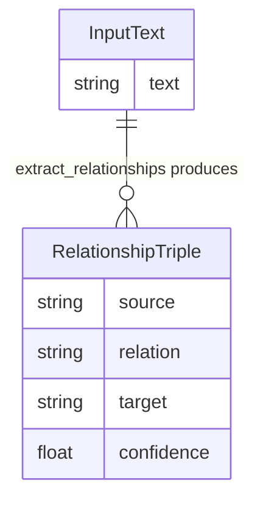

# REASONS Canvas: Knowledge Graph Construction
Date: 2026-07-02
Analysis: 2026-07-02-knowledge-graph-construction-analysis.md
Scope: BE-only

---

## R — Requirements

**Problem:** The pipeline can analyse news sentiment and answer grounded questions from retrieved filings, but has no capability to extract structured financial relationships from text. A caller asking "who supplies NVIDIA's chips?" cannot derive an answer from the pipeline — there is no function that reads a sentence and returns typed, confidence-scored relationship triples. Without this, the platform cannot build a knowledge graph of supply-chain dependencies, partnerships, subsidiaries, or competitor relationships from SEC filings or news text.

**Goal:** Deliver one new pipeline module — `data/knowledge_graph.py` — exposing a single public function that accepts any plain-text sentence or passage, calls the Anthropic Claude API with a financial knowledge graph extraction system prompt, and returns a list of validated relationship triples in `{source, relation, target, confidence}` format, where each triple represents one financially meaningful entity-to-entity relationship extracted from the text.

**Definition of Done:**
- [ ] Given a sentence describing a supply-chain dependency such as "NVIDIA relies heavily on TSMC for manufacturing advanced AI chips.", when `extract_relationships(text)` is called, then the returned list contains at least one triple where source is "NVIDIA", relation identifies the manufacturing or supply relationship, and target is "TSMC"
- [ ] Given a successful API call, when each dict in the returned list is inspected, then it contains exactly four keys: source, relation, target, confidence
- [ ] Given a successful API call, when confidence is inspected on each triple, then it is a Python float between 0.0 and 1.0 inclusive
- [ ] Given an empty string is passed as text, when `extract_relationships` is called, then it returns an empty list without calling the Anthropic API and without raising
- [ ] Given the Anthropic API raises any exception, when `extract_relationships` is called, then it returns an empty list without raising
- [ ] Given the API returns a response with markdown fences around the JSON array, when the response is parsed, then the fences are stripped and the triples are parsed correctly
- [ ] Given the API returns a JSON array where one triple is missing the confidence key, when `extract_relationships` is called, then the invalid triple is skipped and the remaining valid triples are returned
- [ ] Given a sentence with no extractable financial relationships, when `extract_relationships` is called, then it returns an empty list without raising

---

## E — Entities

### Data Entities

The module produces one data shape. A RelationshipTriple is the terminal output of the extraction function — it is a plain Python dict, not a database row or a class instance. Zero or more triples are returned per call as a list.

| Entity | Type | Key Fields | Relationships |
|--------|------|-----------|---------------|
| RelationshipTriple | Output dict (one entry per list item) | source (str), relation (str), target (str), confidence (float 0.0–1.0) | Many per call; returned as a flat list by extract_relationships |

---

## A — Approach

**Pattern:** LLM extraction module — module-level system prompt constant, Anthropic client created inside the function body, private `_parse_llm_response` helper with fence stripping and per-item validation, outer exception boundary

**Strategy:** `data/knowledge_graph.py` is structurally identical to `data/sentiment.py` at the module level — same `_SYSTEM_PROMPT` constant, same `anthropic.Anthropic()` client instantiated inside the function, same fence-stripping helper, same outer `try/except Exception` boundary — but with two key differences from all prior LLM modules. First, the model is instructed to return a JSON array at the top level (not a JSON object), so `_parse_llm_response` must check that the parsed result is a list before iterating. Second, `_parse_llm_response` uses skip-invalid semantics: if one triple in the array fails schema validation, it is skipped and the remaining valid triples are returned; the whole result is not discarded. This is deliberately different from `rag_answer.py`'s nil-on-any-invalid citation strategy — partial extraction of relationships is always more useful to a knowledge graph builder than returning nothing because one triple was malformed.

**Scope In:**
- `extract_relationships(text: str) -> list[dict]` — LLM call, fence stripping, array parse, per-triple validation, confidence clamping
- `_parse_llm_response(text: str) -> list[dict]` — private helper handling array-level and item-level validation with skip-invalid semantics
- `tests/test_knowledge_graph.py` — full test suite with Anthropic client mocked, no live API calls

**Scope Out:**
- No graph database storage or persistence — function returns Python dicts only
- No entity disambiguation or normalisation — source/target strings are returned as the model produces them
- No predefined relation vocabulary enforcement — the model chooses the relation type string; validation only checks it is a non-empty string
- No batch processing of multiple texts — single text input only
- No deduplication of triples — if the model returns the same triple twice, both appear in the result
- No cross-module import from sentiment.py or rag_answer.py — fence-stripping and clamping logic are intentionally duplicated per the no-cross-module-import rule

---

## S — Structure

**Module:** `data/` (Python pipeline, target: Z:\claude\stock_analyzer)

**New Files:**
- `data/knowledge_graph.py` — public function extract_relationships, private helper _parse_llm_response, module-level _SYSTEM_PROMPT constant
- `tests/test_knowledge_graph.py` — 8 tests covering all ACs; Anthropic client mocked via patch decorator; no sys.modules injection needed

**Modified Files:** None — requirements.txt, .env.example, and all existing data modules require no changes

**Database:** None

---

## O — Operations

1. Create `data/knowledge_graph.py` with a module-level `_SYSTEM_PROMPT` string that instructs the model to act as a financial knowledge graph extraction agent, to extract all financially meaningful relationships present in the provided text, and to return them as a JSON array where each element contains exactly four keys — source (the entity the relationship originates from), relation (the relationship type in upper-case, for example SUPPLIER, COMPETITOR, SUBSIDIARY, PARTNER, or CUSTOMER), target (the entity the relationship points to), and confidence (a float between 0.0 and 1.0 representing how certain the model is that the relationship is stated or strongly implied by the text) — with no other text or formatting outside the JSON array; a private `_parse_llm_response(text)` helper that strips markdown fences using the same logic as `data/sentiment.py:18–23` (strip leading and trailing whitespace, check if the result starts with triple backticks, remove all lines that start with triple backticks, rejoin and strip), attempts JSON parse, checks that the result is a list using isinstance (if it is not a list, return an empty list — this guards against the model wrapping the array in an object), then iterates the list and for each item checks that it is a dict, that source, relation, and target are all present and are non-empty strings after stripping, and that confidence is present and castable to float (catch TypeError and ValueError per item), clamps confidence to the range 0.0 to 1.0 using max and min, appends the validated and clamped triple dict to a results list, and skips any item that fails any of these checks without raising (so partial extraction is returned rather than discarding everything on one bad item) — returning the results list which may be empty if all items were invalid; and the `extract_relationships(text: str) -> list[dict]` public function that guards on empty or whitespace-only text by returning an empty list immediately without calling the API, then inside an outer try/except Exception creates an anthropic.Anthropic() client inside the function body (not at module level), calls client.messages.create with model set to "claude-haiku-4-5-20251001", max_tokens set to 512, the module-level system prompt, and a user message that presents the input text asking the model to extract all financial relationships and return only the JSON array, extracts response.content[0].text, calls _parse_llm_response, and returns the result — the outer except returns an empty list on any uncaught error

2. Create `tests/test_knowledge_graph.py` without any sys.modules injection (the anthropic module is not loaded at module level in knowledge_graph.py), importing extract_relationships from data.knowledge_graph; define `_make_llm_response(text)` and `_mock_client(response_text)` helper functions following the exact shape from test_sentiment.py — _make_llm_response accepts a text string and returns a MagicMock whose content attribute is a list containing a MagicMock with a text attribute set to the input string, and _mock_client accepts a text string and returns a MagicMock whose messages.create.return_value is the llm response mock; define module-level fixture constants: a valid supply-chain sentence about NVIDIA and TSMC, a valid JSON array string containing two triples (one NVIDIA-SUPPLIER-TSMC and one NVIDIA-CUSTOMER-Apple each with a confidence float), a fenced version of the same JSON array wrapped in triple backtick json fences, a malformed response string that is not valid JSON, and a mixed-validity JSON array string that contains one valid triple and one triple missing the confidence key; write the following tests all using patch("data.knowledge_graph.anthropic.Anthropic") as the mock point: schema test asserting each returned dict has exactly four keys matching the expected set; happy-path triple values test asserting the first triple's source is "NVIDIA", relation is non-empty, target is "TSMC", and confidence is the expected float value; confidence type and range test asserting confidence is an instance of float and is between 0.0 and 1.0 inclusive; empty text test asserting the function returns an empty list without calling the Anthropic constructor when an empty string is passed; Anthropic exception test where the mock constructor raises and the function returns an empty list without raising; fence stripping test using the fenced fixture and asserting the result is non-empty and the first triple has the expected source value; malformed JSON test asserting the function returns an empty list without raising; skip-invalid triple test using the mixed-validity fixture and asserting the function returns exactly one triple (the valid one) rather than zero or two — proving that the invalid triple is skipped and the valid one is preserved

---

## N — Norms

### Pipeline Norms

- Module-per-concern: knowledge_graph.py owns financial relationship extraction — it does not import from sentiment.py, rag_answer.py, or any other data module
- All public functions must have an outer exception boundary — extract_relationships must never raise to its caller under any circumstances
- Return type: extract_relationships returns a list (empty list is the fallback for all failure modes, not None and not a dict)
- No module-level fallback constant needed — the universal fallback is the Python literal empty list; it does not require a named constant
- Private helpers prefixed with underscore: _parse_llm_response
- The Anthropic client must be instantiated inside the function body, not at module level — this is the established pattern from sentiment.py and must not be changed
- All external calls (Anthropic API) must be mocked in tests — no live network calls in the test suite
- Python 3.9 compatible — no bare X or Y union type hints
- Skip-invalid semantics in _parse_llm_response: a single malformed triple must not discard the entire result — iterate, validate per item, skip on failure, return the valid subset

---

## S — Safeguards

### Pipeline Safeguards

- Never let an Anthropic API exception propagate past the module boundary — the outer try/except catches everything and returns an empty list
- The model response must be checked with isinstance before iterating — if json.loads succeeds but returns a dict instead of a list, return an empty list; do not attempt to iterate a dict as though it were a list of triples
- confidence clamping is required per triple, not optional — the model self-estimates confidence and may return values above 1.0 or below 0.0; clamp with max(0.0, min(1.0, raw)) before appending to results
- source, relation, and target must all be validated as non-empty strings after stripping — an empty string in any of the three key fields produces a useless triple and must be skipped
- TypeError and ValueError from float(raw_confidence) must be caught per item inside the loop — they must not propagate to the outer exception handler and must not discard other valid triples
- Empty and whitespace-only text must return an empty list without calling the API — guard at the top of extract_relationships before creating the Anthropic client; mock_cls.assert_not_called() in the corresponding test verifies this
- Do not use get_or_create or any state-creating pattern — this module is read-only with respect to all external systems; it only calls the Anthropic API and returns Python objects
- No cross-module import — knowledge_graph.py must not import fence-stripping or clamping helpers from other data modules; duplicate the logic in full

---

## Change Log

[Appended by /prompt-update and /sync]
