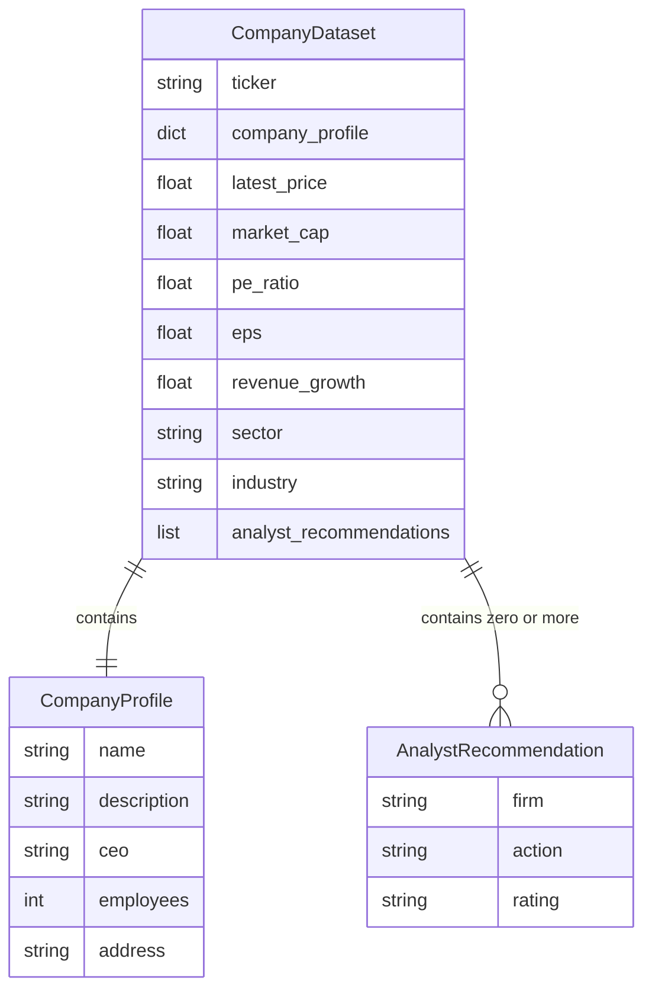

# REASONS Canvas: OpenBB Company Dataset Fetch
Date: 2026-07-02
Analysis: 2026-07-02-openbb-company-dataset-fetch-analysis.md
Scope: BE-only

---

## R — Requirements

**Problem:** The pipeline has no way to retrieve a comprehensive company profile, market quote, and analyst data for a given ticker from a single call. The existing `get_fundamentals` in `data/stock.py` covers only five metrics via yfinance; there is no function that combines profile, price, fundamentals, and analyst recommendations into one standardised output dict.

**Goal:** Deliver a new module `data/openbb_client.py` exposing `get_company_dataset(ticker)` that calls the OpenBB Python SDK, retrieves nine fields across multiple endpoint categories, normalises all values to Python-native types, and returns a single dict that is always safe to pass to `json.dumps` without preprocessing.

**Definition of Done:**
- [ ] Given a valid ticker such as "AAPL", when `get_company_dataset` is called, then the returned dict contains exactly nine top-level keys: company_profile, latest_price, market_cap, pe_ratio, eps, revenue_growth, sector, industry, analyst_recommendations
- [ ] Given a valid ticker, when the OpenBB SDK returns a numeric value for any field, then the value in the returned dict is a Python-native float or int — never a numpy scalar, pandas Series, or Pydantic model attribute
- [ ] Given a valid ticker with available analyst recommendations, when `get_company_dataset` is called, then analyst_recommendations is a list of dicts each containing at minimum firm, action, and rating keys
- [ ] Given analyst recommendations are unavailable or the recommendations endpoint fails, when `get_company_dataset` is called, then analyst_recommendations is None — not an empty list
- [ ] Given any individual field is missing from the OpenBB response or fails to parse, when the function processes that field, then the returned dict contains None for that key rather than omitting the key or raising
- [ ] Given an invalid or unknown ticker, when `get_company_dataset` is called, then it returns a dict where all nine values are None and does not raise
- [ ] Given the OpenBB SDK raises any exception during client instantiation or a catastrophic shared call, when `get_company_dataset` is called, then it catches the exception and returns the all-None fallback dict without raising
- [ ] Given `get_company_dataset` returns any result, when `json.dumps(result)` is called on it, then no TypeError is raised — for both the full happy-path dict and the all-None fallback

---

## E — Entities

### Data Entities

The output of `get_company_dataset` is a single Python dict. Its structure defines three conceptual shapes: the top-level dataset, the nested company_profile sub-dict, and the individual analyst recommendation entry within the list.

| Entity | Type | Key Fields | Relationships |
|--------|------|-----------|---------------|
| CompanyDataset | New output dict | company_profile, latest_price, market_cap, pe_ratio, eps, revenue_growth, sector, industry, analyst_recommendations | Contains one CompanyProfile and zero-or-more AnalystRecommendation entries |
| CompanyProfile | Nested dict (within CompanyDataset) | name, description, ceo, employees, address | Contained by CompanyDataset |
| AnalystRecommendation | Dict entry in a list | firm, action, rating | Zero or more per CompanyDataset; list is None if none are available |

---

## A — Approach

**Pattern:** Module-per-concern, per-field exception isolation, private helper extraction

**Strategy:** Create `data/openbb_client.py` as a self-contained module that follows the same patterns established by `data/stock.py` and `data/sentiment.py`. The public function `get_company_dataset` wraps multiple OpenBB endpoint calls — each in its own independent try/except block — so that one failing endpoint assigns None to its fields without aborting the others. An outer try/except acts as the final safety net. The `_parse_recommendations` private helper isolates list-normalisation logic, consistent with how `_parse_llm_response` isolates JSON parsing in `data/sentiment.py`. The yfinance provider is used as the default so no new API key is required.

**Scope In:**
- Single-ticker retrieval via `get_company_dataset(ticker)`
- Nine output fields: company_profile, latest_price, market_cap, pe_ratio, eps, revenue_growth, sector, industry, analyst_recommendations
- Per-field exception isolation for all four OpenBB endpoint calls
- `_safe_float` private helper (copied, not imported)
- `_parse_recommendations` private helper returning list of dicts or None
- `_EMPTY_DATASET` module-level fallback constant
- Full test suite in `tests/test_openbb_client.py` with all SDK calls mocked
- `requirements.txt` updated with openbb at a pinned version

**Scope Out:**
- No multi-ticker batch calls
- No caching or persistence of results
- No OpenBB Hub authentication or API key management — yfinance is the default provider
- No historical OHLCV data (already in `data/stock.py`)
- No integration with `generate_recommendation` or `analyze_sentiment` (separate story)
- No Pydantic schema validation or custom JSON encoder class
- No shared utility module — `_safe_float` is copied, not extracted

---

## S — Structure

**Module:** `data/openbb_client.py` (new file)

**New Files:**
- `data/openbb_client.py` — public function `get_company_dataset`, private helpers `_safe_float`, `_parse_recommendations`, and module-level constant `_EMPTY_DATASET`
- `tests/test_openbb_client.py` — full test suite with all OpenBB SDK calls mocked via `unittest.mock.patch`

**Modified Files:**
- `requirements.txt` — add openbb package with pinned version
- `.env.example` — add OPENBB_TOKEN entry with note that it is only required when using the OpenBB Hub provider, not the yfinance default

**Database:** None — this is a stateless data retrieval module

---

## O — Operations

1. Update `requirements.txt` to add the openbb package at a pinned stable version compatible with Python 3.9 — use the v4 package series which provides the `obb.equity` router namespace used in subsequent steps

2. Update `.env.example` to add an `OPENBB_TOKEN` entry with a comment explaining it is only required when using the OpenBB Hub as a data provider; the default yfinance provider does not need this key

3. Create `data/openbb_client.py` and define the `_EMPTY_DATASET` module-level constant as a dict with all nine keys set to None — this is the canonical fallback returned on total failure via `.copy()`; define the `_safe_float` private helper copied verbatim from the pattern in `data/stock.py`, which accepts any value and returns a Python-native float or None; define the `_parse_recommendations` private helper that accepts a raw OpenBB response for the recommendations endpoint, iterates its results, extracts firm, action, and rating from each row using safe attribute or key access with None fallbacks, and returns either a list of such dicts (each containing only str or None values) or None if the input is empty, None, or structurally invalid

4. Implement `get_company_dataset(ticker)` in `data/openbb_client.py` — begin with an outer try/except that returns `_EMPTY_DATASET.copy()` on catastrophic failure; inside, initialise the result dict from `_EMPTY_DATASET.copy()`; call the OpenBB profile endpoint (for name, description, ceo, employees, address, sector, and industry) in its own inner try/except, populating `company_profile` as a nested dict of string fields and promoting `sector` and `industry` to the top level; call the quote endpoint (for latest_price) in its own inner try/except; call the fundamental metrics endpoint (for market_cap, pe_ratio, eps, and revenue_growth) in its own inner try/except, normalising each with `_safe_float`; call the analyst recommendations endpoint in its own inner try/except, passing the raw response to `_parse_recommendations` and assigning the result to `analyst_recommendations`; return the assembled dict

5. Create `tests/test_openbb_client.py` with all OpenBB calls mocked via `unittest.mock.patch` at the module-level client object — write the following tests: schema test asserting all nine keys are present and `len(result) == 9`; happy-path test asserting each field has the correct Python-native type (float for numeric scalars, dict for company_profile, list for analyst_recommendations); numpy scalar normalisation test passing `np.float64` values into the mock and asserting the result fields are `type(...) is float`; partial-response test where one endpoint mock raises an exception and the test asserts that the failing field is None while all other fields remain populated; invalid-ticker test asserting all nine values are None and no exception is raised; SDK-exception test where the client instantiation raises and the test asserts the all-None fallback is returned; json.dumps serialisability test calling `json.dumps(result)` on both the happy-path result and the all-None fallback and asserting no TypeError is raised

---

## N — Norms

### Pipeline Norms

- Module-per-concern: each file in `data/` owns one concern and exposes one or two public functions; `data/openbb_client.py` owns only OpenBB retrieval
- All public functions must have an outer exception boundary — `get_company_dataset` must never raise to its caller under any circumstances
- Return dicts must use Python-native types only — float, int, str, bool, None, list of dicts, nested dict; no numpy scalars, no pandas objects, no Pydantic model instances
- Module-level constants define the fallback dict shape; always return via `.copy()` to prevent mutation of the canonical constant
- Private helpers are prefixed with underscore — `_safe_float`, `_parse_recommendations`
- No cross-module imports in the `data/` layer — `_safe_float` is copied into `data/openbb_client.py`, not imported from `data/stock.py`
- All external SDK calls must be mocked in tests — no live network calls in the test suite
- Python 3.9 compatible — no bare `X | Y` union type hints in function signatures; use string annotations or `Union[X, Y]` from `typing`
- Commit `requirements.txt` with a pinned version — no floating `>=` specifiers for new dependencies

---

## S — Safeguards

### Pipeline Safeguards

- Never let an exception from the OpenBB SDK propagate past the module boundary — every call site must be covered by try/except
- Never return a numpy scalar, pandas object, or Pydantic model attribute directly from a public function — always pass through `_safe_float` or an equivalent normaliser
- Per-field exception isolation is mandatory — if the recommendations endpoint fails, the profile and price fields must still be returned; one failure must not abort the entire response
- Pin the openbb version in `requirements.txt` before writing implementation — the v3 and v4 API surfaces are completely incompatible and the correct endpoint namespace depends on the installed version
- Confirm the OBBject wrapper shape by inspecting `.results` before assuming it is a list of plain dicts — in v4 it may be a list of Pydantic model instances; access fields via attribute access and wrap in `_safe_float` or `str()` accordingly
- `_parse_recommendations` must return None (not an empty list) when recommendations are unavailable — callers rely on `is None` to distinguish "no data" from "empty list"
- Do not require a new environment variable for the default provider — the yfinance provider must work without setting OPENBB_TOKEN
- The `_EMPTY_DATASET` constant must never be mutated — always return `.copy()`
- Do not add a `data/utils.py` shared module — the no-cross-module-import rule takes precedence over DRY for six-line helpers

---

## Change Log

[Appended by /prompt-update and /sync]
