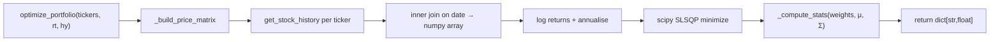

# REASONS Canvas: Portfolio Optimization Agent
Date: 2026-07-02
Analysis: 2026-07-02-portfolio-optimization-agent-analysis.md
Scope: BE-only

---

## R — Requirements

**Problem:** The pipeline has no portfolio-level function. Callers who want Markowitz-optimal allocations must fetch price data, compute returns, run the optimizer, and cast types themselves — reimplementing the same math for every consumer.

**Goal:** A single function `optimize_portfolio(tickers, risk_tolerance, horizon_years)` fetches price history, runs mean-variance optimisation, and returns optimal weights, expected return, volatility, and Sharpe ratio — all as Python-native floats. It never raises.

**Definition of Done:**
- [ ] Given tickers, risk_tolerance 0.5, horizon_years 5, when called with mocked prices, then result has exactly the keys `weights`, `expected_return`, `volatility`, `sharpe_ratio`
- [ ] Given valid inputs, then `sum(result["weights"].values())` is within 1e-6 of 1.0 and all weights are ≥ 0.0
- [ ] Given valid inputs, then `expected_return`, `volatility`, and `sharpe_ratio` are Python `float` (not numpy scalars)
- [ ] Given risk_tolerance 0.0 with differentiated mocked returns, then single-asset concentration is a valid optimizer output
- [ ] Given risk_tolerance 1.0 with identical mocked returns, then weights are approximately equal
- [ ] Given empty tickers list, then `_EMPTY_PORTFOLIO` is returned without raising
- [ ] Given a single ticker, then weights dict contains that ticker at 1.0 and stats are computed from its history
- [ ] Given a ticker whose `get_stock_history` returns empty, then that ticker is dropped silently; if all fail, return `_EMPTY_PORTFOLIO`
- [ ] Given risk_tolerance outside [0, 1], then it is clamped — no raise
- [ ] Given horizon_years ≤ 0 or non-numeric, then `_EMPTY_PORTFOLIO` is returned
- [ ] Given fewer than 2 aligned trading-day observations, then `_EMPTY_PORTFOLIO` is returned
- [ ] Given volatility equals zero, then Sharpe ratio is 0.0 (no division by zero)
- [ ] `scipy>=1.11` added to `requirements.txt`
- [ ] `tests/test_portfolio.py` written with all `get_stock_history` calls mocked — no real HTTP
- [ ] All new tests pass; full suite of 112 + new tests remains green

---

## E — Entities

### Data Contracts

| Name | Kind | Fields | Notes |
|---|---|---|---|
| `optimize_portfolio` input | Function parameters | `tickers: list[str]`, `risk_tolerance: float [0,1]`, `horizon_years: int/float > 0` | `risk_tolerance` is clamped not validated; `horizon_years` is validated |
| `_EMPTY_PORTFOLIO` | Module constant | `weights: None`, `expected_return: None`, `volatility: None`, `sharpe_ratio: None` | Returned via `.copy()` on any failure |
| Successful result | Return dict | `weights: dict[str, float]`, `expected_return: float`, `volatility: float`, `sharpe_ratio: float` | All annualised; all Python-native float |
| Price matrix | Internal array | shape `(n_days, n_tickers)`, float64 | Built from `get_stock_history` close prices, inner-joined on date; never leaves the module |
| Log-return matrix | Internal array | shape `(n_days-1, n_tickers)`, float64 | `np.log(prices[1:] / prices[:-1])`; annualised by ×252 |

### Module Flow

---

## A — Approach

**Pattern:** Single-module pure-Python function with a private price-fetching helper, a private stats helper, and a `scipy` SLSQP optimizer at the centre.

**Strategy:** Fetch close prices for each ticker over a `horizon_years × 365` day window by calling the existing `get_stock_history`. Align all tickers to their common trading dates (inner join) to produce a balanced panel, then compute log returns and annualise. Pass mean returns and covariance matrix to `scipy.optimize.minimize(method="SLSQP")` with the weighted objective `(1 − risk_tolerance) × (−portfolio_return) + risk_tolerance × portfolio_variance`. SLSQP enforces the weights-sum-to-1 equality constraint and the weights-≥-0 bounds constraint natively. Every numpy value in the result is cast to `float()` before the dict is returned. The outer `try/except Exception → _EMPTY_PORTFOLIO.copy()` is the unconditional last line of defence.

**Scope In:**
- `optimize_portfolio(tickers, risk_tolerance, horizon_years)` — one public function, one new module
- Long-only portfolio: weights in [0, 1], sum to 1
- Log returns, annualised by ×252
- Sharpe ratio with risk-free rate = 0.0
- `scipy>=1.11` added to `requirements.txt`

**Scope Out:**
- Short-selling and leverage (negative weights)
- Sector, concentration, or turnover constraints
- Risk-free rate as a parameter (deferred)
- Black-Litterman or other alternative optimisers (deferred)
- Persistent storage of results
- CLI or HTTP endpoint

---

## S — Structure

**Module:** `Z:\claude\stock_analyzer\data\`

**New Files:**
- `data/portfolio.py` — `optimize_portfolio` public function, `_EMPTY_PORTFOLIO` constant, `_safe_float`, `_build_price_matrix`, `_compute_stats` private helpers
- `tests/test_portfolio.py` — full test suite, all `get_stock_history` calls mocked at `data.portfolio.get_stock_history`

**Modified Files:**
- `requirements.txt` — add `scipy>=1.11` on a new line

**No database changes.** No other `data/` modules modified.

---

## O — Operations

1. Add `scipy>=1.11` to `requirements.txt` and install it via `Z:\python39\python.exe -m pip install scipy` — confirm import works before writing any code

2. Create `data/portfolio.py` — write the module-level constant `_EMPTY_PORTFOLIO` (4 keys, all None) and the local `_safe_float` helper (copied from `data/stock.py` pattern, no cross-module import)

3. Write `_build_price_matrix(tickers, start, end)` — calls `get_stock_history` for each ticker, extracts the close price keyed by date, performs inner join across all tickers (keep only dates present in every ticker's history), returns a tuple of the aligned numpy price array of shape `(n_days, n_tickers)` and the surviving ticker list; returns `(None, [])` if fewer than 2 aligned rows remain or any ticker list is empty after dropping failures

4. Write `_compute_stats(weights_array, mean_returns, cov_matrix)` — computes portfolio expected return as dot product of weights and mean returns, portfolio variance as the quadratic form `wᵀΣw`, volatility as its square root, Sharpe as return divided by volatility with a zero-volatility guard; all return values are Python `float` cast explicitly

5. Write `optimize_portfolio(tickers, risk_tolerance, horizon_years)` — entry-point guards in this order: empty tickers list → `_EMPTY_PORTFOLIO`; non-numeric or ≤0 `horizon_years` → `_EMPTY_PORTFOLIO`; clamp `risk_tolerance` to [0.0, 1.0]; compute `start` and `end` dates from `datetime.date.today()` and `horizon_years`; call `_build_price_matrix`; if matrix is None or fewer than 2 rows → `_EMPTY_PORTFOLIO`

6. Within `optimize_portfolio` — single-ticker shortcut: if exactly one ticker survives after `_build_price_matrix`, compute log returns for that ticker only, compute stats with weight=1.0, build weights dict as `{ticker: 1.0}`, return result without calling `scipy`

7. Within `optimize_portfolio` — multi-ticker SLSQP call: compute log return matrix, annualise mean returns (×252) and covariance matrix (×252), set equal-weight initial guess, define the weighted objective function, define the sum-to-1 equality constraint and the `[(0.0, 1.0)] * n` bounds, call `scipy.optimize.minimize`; if `result.success` is False return `_EMPTY_PORTFOLIO`; otherwise build output dict using `dict(zip(tickers, [float(w) for w in result.x]))`, call `_compute_stats`, return the 4-key result dict; wrap the entire multi-ticker branch in `try/except Exception → _EMPTY_PORTFOLIO.copy()`

8. Create `tests/test_portfolio.py` — write a `_make_history(prices)` fixture factory that builds the list-of-dicts format `get_stock_history` returns; write happy-path tests: schema (4 keys present), weights sum to 1.0 within 1e-6, all weights ≥ 0, all numerics are Python `float` not numpy scalars; use `@patch("data.portfolio.get_stock_history")` with `side_effect` to return different history per ticker

9. Add diversification tests — risk_tolerance=0.0 with strongly differentiated mocked returns (assert that the result is valid, not that specific weights appear); risk_tolerance=1.0 with identical mocked returns for all tickers (assert all weights approximately equal, within tolerance)

10. Add edge-case tests — empty tickers list returns all-None dict; single ticker returns weight dict with that ticker at 1.0; one ticker's `get_stock_history` returns `[]` and the remaining tickers still produce a valid result; all tickers return `[]` produces `_EMPTY_PORTFOLIO`; `risk_tolerance=-0.5` clamped to 0.0 and still runs without error; `horizon_years=0` returns `_EMPTY_PORTFOLIO`; `horizon_years="bad"` returns `_EMPTY_PORTFOLIO`; fewer than 2 aligned rows returns `_EMPTY_PORTFOLIO`

11. Run full suite — `& "Z:\python39\python.exe" -m pytest tests/ -v` — confirm all 112 prior tests plus all new portfolio tests pass

---

## N — Norms

### Python Pipeline Norms

- Module path: `data/<module_name>.py` — one concern per file, one or two public functions per module
- Every public function has an outer `try/except Exception` that returns the module-level `_EMPTY_X.copy()` fallback — never raises to the caller
- All return dict values are Python-native types only: `str`, `int`, `float`, `bool`, `list`, `dict`, `None` — no numpy scalars, no pandas objects
- Module-level fallback constants are defined once at the top of the file; always returned via `.copy()` so callers cannot mutate the module constant
- Private helpers are prefixed with `_`; they may be called across the module but are never imported by other modules
- No cross-module helper imports inside `data/` — copy shared helpers locally (e.g. `_safe_float`)
- Tests use `unittest.mock.patch` to stub every external call; no real network or filesystem I/O in the test suite
- Test naming convention: `test_<what>_<condition>` — e.g. `test_empty_tickers_returns_empty_portfolio`
- All test mock patches target the function as imported in the module under test: `data.portfolio.get_stock_history`

---

## S — Safeguards

### Python Pipeline Safeguards

- Never let a public function raise — all exceptions must be caught and result in the fallback dict
- Never return numpy or pandas types in a public function's output dict — always cast with `float()`, `int()`, `str()` before building the return value
- Never import from another `data/` module to share a helper — copy it locally
- Never write a test that makes a real HTTP request — mock `get_stock_history` at the module level
- Never commit code that breaks the existing 112-test suite — run the full suite before declaring done

### Feature-specific Safeguards

- `scipy` must be installed before any portfolio test runs — add to `requirements.txt` and `pip install` first; failure to install will silently pass import-time guards
- Check `result.success` after every `scipy.optimize.minimize` call — a converged-but-failed optimizer can return a numerically valid-looking `result.x` that violates constraints
- Guard against zero volatility before computing Sharpe: return 0.0 if volatility is zero, never divide
- The inner-join date alignment must happen before computing the covariance matrix — passing a ragged or NaN-containing matrix to `scipy` produces silent numerical garbage, not an error
- `result.x` from `scipy` is a numpy array — wrap every element with `float()` when building the weights dict; do not use `tolist()` on the whole array as it only strips one level of numpy wrapping

---

## Change Log

_Canvas generated 2026-07-02 from analysis `2026-07-02-portfolio-optimization-agent-analysis.md`._
