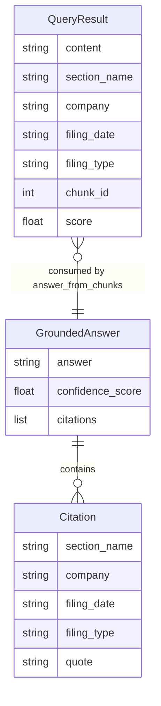

# REASONS Canvas: RAG Query and Grounded Answer
Date: 2026-07-02
Analysis: 2026-07-02-rag-query-and-grounded-answer-analysis.md
Scope: BE-only

---

## R — Requirements

**Problem:** The pipeline can ingest 10-K filings and store their chunks as vectors (Stories 7–9), but has no way to retrieve those vectors in response to a natural language question and no way to synthesise an evidence-grounded answer. A downstream caller asking "What did Apple report for revenue in 2025 Q1?" has nowhere to go — there is no retrieval function and no answer function.

**Goal:** Deliver two new pipeline modules — `data/rag_query.py` and `data/rag_answer.py` — that together complete the retrieval side of the RAG pipeline: embed a question, query ChromaDB for the most relevant filing chunks, then call the Anthropic Claude API with a strict evidence-only system prompt to synthesise a structured JSON answer with source citations and a confidence score.

**Definition of Done:**

Story 10 — rag_query:
- [ ] Given a question string and a valid collection name, when `retrieve_chunks(question, collection_name)` is called, then it returns a list of dicts
- [ ] Given a successful retrieval, when each dict is inspected, then it contains exactly seven keys: content, section_name, company, filing_date, filing_type, chunk_id, score
- [ ] Given `n_results=3`, when `retrieve_chunks` is called and the collection has at least 3 chunks, then at most 3 chunks are returned
- [ ] Given score is inspected on returned chunks, when scores are compared, then lower score values indicate higher semantic similarity
- [ ] Given a collection that does not exist, when `retrieve_chunks` is called, then it returns an empty list and does not raise
- [ ] Given the ChromaDB client or the embedding model raises any exception, when `retrieve_chunks` is called, then it returns an empty list and does not raise

Story 11 — rag_answer:
- [ ] Given a non-empty chunks list and a question, when `answer_from_chunks(question, chunks)` is called, then it returns a dict containing exactly three keys: answer, confidence_score, citations
- [ ] Given a successful API call, when confidence_score is inspected, then it is a Python float between 0.0 and 1.0 inclusive
- [ ] Given a successful API call, when citations is inspected, then each citation dict contains section_name, company, filing_date, filing_type, and quote
- [ ] Given an empty chunks list, when `answer_from_chunks` is called, then answer is "No relevant filings found.", confidence_score is 0.0, and citations is an empty list, and no exception is raised
- [ ] Given the Anthropic API raises any exception, when `answer_from_chunks` is called, then the error fallback dict is returned without raising
- [ ] Given the API returns a response with markdown fences around the JSON, when the response is parsed, then the fences are stripped and the JSON is parsed correctly
- [ ] Given the API returns malformed JSON or a citations list missing required keys, when `answer_from_chunks` is called, then the error fallback dict is returned without raising

---

## E — Entities

### Data Entities

The two new modules each produce one data shape. `QueryResult` flows from `retrieve_chunks` into `answer_from_chunks` as the chunks argument; `GroundedAnswer` is the terminal output of the pipeline. `Citation` is a nested structure within `GroundedAnswer`.

| Entity | Type | Key Fields | Relationships |
|--------|------|-----------|---------------|
| QueryResult | Output dict of retrieve_chunks (one entry per list item) | content, section_name, company, filing_date, filing_type, chunk_id, score | Many per query; consumed as the chunks list by answer_from_chunks |
| GroundedAnswer | Output dict of answer_from_chunks | answer, confidence_score, citations | Terminal output; contains a list of Citation items |
| Citation | Nested dict within GroundedAnswer.citations | section_name, company, filing_date, filing_type, quote | Many per GroundedAnswer; each cites one source chunk |

---

## A — Approach

**Pattern:** Module-per-concern, exception boundary per module, direct template reuse from existing modules

**Strategy:** `data/rag_query.py` follows `data/vector_store.py` as its direct template — same module-level `_MODEL` loading, same `chromadb.PersistentClient` initialisation inside the function, same outer exception boundary, same `sys.modules` test isolation pattern — but calls `collection.query()` instead of `collection.upsert()`. `data/rag_answer.py` follows `data/sentiment.py` as its direct template — same module-level `_SYSTEM_PROMPT`, same Anthropic client created inside the function, same `_parse_llm_response` fence-stripping helper, same two fallback constants — but the system prompt enforces evidence-only reasoning and the parsed schema includes a citations list with nested citation dicts and a clamped confidence score. The two new modules do not import each other; the caller passes `retrieve_chunks` output directly into `answer_from_chunks`.

**Scope In:**
- `retrieve_chunks(question, collection_name, n_results)` — question embedding, ChromaDB query, 7-key result dicts
- `answer_from_chunks(question, chunks)` — Anthropic call with evidence-only system prompt, fence stripping, citations validation, confidence_score clamping
- Full test suite for both modules — no new dependencies needed

**Scope Out:**
- No multi-collection fan-out — caller supplies one collection name
- No ranking, re-ranking, or relevance threshold filtering of query results
- No streaming, pagination, or caching of query results or embeddings
- No conversational memory or follow-up questions — single-turn Q&A only
- No token count tracking or chunk count limiting before Anthropic call
- No HTTP endpoint or UI — Python functions only
- No end-to-end orchestration function wiring the two modules together (separate story)

---

## S — Structure

**New Files:**
- `data/rag_query.py` — public function retrieve_chunks, module-level MODEL_NAME and _MODEL
- `data/rag_answer.py` — public function answer_from_chunks, private helper _parse_llm_response, module-level _SYSTEM_PROMPT, _EMPTY_ANSWER, _ERROR_ANSWER
- `tests/test_rag_query.py` — sys.modules injection, _MODEL and chromadb.PersistentClient mocked per test
- `tests/test_rag_answer.py` — anthropic.Anthropic constructor mocked per test, no sys.modules injection needed

**Modified Files:** None — requirements.txt and .env.example require no changes; all dependencies and env vars are already declared

**Database:** No changes — queries the existing ChromaDB persistent store written by ingest_chunks; read-only from rag_query.py's perspective

---

## O — Operations

1. Create `data/rag_query.py` with a MODULE_NAME constant set to "all-MiniLM-L6-v2" (declared independently per the no-cross-module-import rule — not imported from vector_store.py) and a module-level _MODEL instance created by calling SentenceTransformer with that model name; and the retrieve_chunks public function that reads CHROMA_PERSIST_DIR from the environment (defaulting to ".chroma"), initialises a chromadb.PersistentClient at that path, calls client.get_collection with the caller-supplied collection name (not get_or_create_collection, so a missing collection raises and is caught by the exception boundary), encodes the question as a batch of one by passing a single-element list to _MODEL.encode and taking index zero of the result to produce the query embedding vector, calls collection.query with query_embeddings set to a list containing that single embedding vector, n_results set to the n_results argument, and include set to a list of "documents", "metadatas", and "distances", then unpacks the result by indexing position zero of result["documents"], result["metadatas"], and result["distances"] (the ChromaDB query API returns list-of-lists with one inner list per query vector; indexing zero extracts the results for the single query), zips the three flat lists to assemble a list of dicts where content comes from the documents list, section_name, company, filing_date, filing_type, and chunk_id come from the corresponding metadata dict, and score is the distance value cast to Python float, and returns the assembled list — the whole function is wrapped in an outer try/except that returns an empty list on any uncaught error

2. Create `data/rag_answer.py` with a _SYSTEM_PROMPT module-level string that instructs the model to act as a financial analyst answering questions strictly from the provided filing chunks, explicitly forbids using prior knowledge or training data, and specifies the exact required JSON output schema: an "answer" field (string, the direct answer to the question based only on the provided text), a "confidence_score" field (float between 0.0 and 1.0 representing how well the retrieved evidence actually answers the question — should be low when the evidence is tangential or incomplete), and a "citations" field (a list of objects each containing "section_name", "company", "filing_date", "filing_type", and "quote" — where quote is a short verbatim excerpt from the provided chunk text that directly supports the answer); module-level _EMPTY_ANSWER constant with answer set to "No relevant filings found.", confidence_score set to 0.0, and citations set to an empty list; module-level _ERROR_ANSWER constant with answer set to "Error generating answer.", confidence_score set to 0.0, and citations set to an empty list; a _parse_llm_response private helper that accepts the raw response text, strips markdown fences using the same fence-detection logic as data/sentiment.py (strip leading and trailing whitespace, check if the result starts with triple backticks, remove all lines that start with triple backticks, rejoin and strip), attempts JSON parse, validates that "answer" is a string, that "confidence_score" is present and castable to float and clamps the value to the range 0.0 to 1.0 using max and min, that "citations" is a list where every item is a dict containing all five required keys (section_name, company, filing_date, filing_type, quote), and returns the validated dict with the clamped confidence_score or returns None on any validation failure; and the answer_from_chunks public function that guards on an empty or falsy chunks list by returning _EMPTY_ANSWER.copy() immediately without calling the API, assembles the user message by formatting the question followed by the chunk texts presented as numbered evidence items with their section name, company, filing date, and content, creates an anthropic.Anthropic() client inside the function (not at module level), calls client.messages.create with model set to "claude-haiku-4-5-20251001", max_tokens set to 1024, the module-level system prompt, and the assembled user message, extracts response.content[0].text, calls _parse_llm_response, returns the validated dict if not None or returns _ERROR_ANSWER.copy() otherwise — the whole function is wrapped in an outer try/except that returns _ERROR_ANSWER.copy() on any uncaught error

3. Create `tests/test_rag_query.py` injecting sys.modules.setdefault for both "sentence_transformers" and "chromadb" before the import of data.rag_query (identical to the injection pattern in test_vector_store.py), then importing retrieve_chunks and binding data.rag_query to a module alias; define module-level fixture constants: a question string, a collection name string, and a mock ChromaDB query result in the correct list-of-lists format where "documents", "metadatas", and "distances" are each a list containing one inner list — the inner list for documents contains two content strings, the inner list for metadatas contains two dicts each with section_name, company, filing_date, filing_type, and chunk_id keys, and the inner list for distances contains two floats; define a _make_mocks helper that creates a mock_model where encode returns a MagicMock whose index-zero access and tolist chain returns a valid embedding list, creates a mock_collection where the query method returns the fixture dict, and creates a mock_client where get_collection returns the mock_collection; write the following tests using patch.object on the module alias to replace _MODEL and patching chromadb.PersistentClient within the module: schema test asserting each returned dict has exactly seven keys matching the expected set; happy-path field values test asserting content, section_name, company, filing_date, filing_type, chunk_id, and score all carry the expected values from the fixture; score-is-float test asserting the score field type is Python float; n_results enforcement test asserting the mock collection's query was called with n_results equal to the value passed; missing collection test where get_collection raises an exception and the function returns an empty list without raising; model exception test where _MODEL.encode raises a RuntimeError and the function returns an empty list without raising

4. Create `tests/test_rag_answer.py` without any sys.modules injection (the anthropic module is not loaded at module level in rag_answer.py); define _make_llm_response and _mock_client helper functions following the exact shape from test_sentiment.py — _make_llm_response accepts a text string and returns a MagicMock whose content attribute is a list containing a MagicMock with a text attribute set to the input string, and _mock_client accepts a text string and returns a MagicMock whose messages.create.return_value is the llm response mock; define module-level fixture constants: a question string about Apple revenue, a two-item chunks list where each chunk dict contains all seven fields from retrieve_chunks output (content, section_name, company, filing_date, filing_type, chunk_id, score), a valid JSON response string with answer, confidence_score of 0.85, and a citations list with one citation containing all five required keys, a fenced version of the same JSON wrapped in triple backtick json fences, and a malformed response string that is not valid JSON; write the following tests all using patch("data.rag_answer.anthropic.Anthropic") as the mock point: schema test asserting the returned dict has exactly three keys; happy-path test asserting answer is a non-empty string, confidence_score is a float, and citations is a list; confidence_score type and range test asserting the value is an instance of float and is between 0.0 and 1.0 inclusive; citations keys test asserting each citation dict in the list contains all five required keys; empty chunks test asserting the function returns the _EMPTY_ANSWER values without calling the Anthropic constructor; Anthropic exception test where the mock constructor raises and the function returns _ERROR_ANSWER values without raising; fence stripping test using the fenced fixture and asserting the result is valid (not the error fallback); malformed JSON test asserting the error fallback is returned without raising; citations missing-key test where the mocked response has a citations list but one citation is missing the "quote" key, asserting the error fallback is returned

---

## N — Norms

### Pipeline Norms

- Module-per-concern: rag_query owns ChromaDB retrieval; rag_answer owns Anthropic synthesis — they do not import each other
- All public functions must have an outer exception boundary — neither function may raise to its caller under any circumstances
- Return types: retrieve_chunks returns a list (empty list is the fallback, not None), answer_from_chunks returns a dict
- Module-level constants define fallback shapes — _EMPTY_ANSWER and _ERROR_ANSWER as named dicts; always return via .copy()
- Private helpers prefixed with underscore: _parse_llm_response
- No cross-module imports in the data/ layer — rag_query and rag_answer must not import from vector_store, sentiment, or any other data module
- All external calls (ChromaDB, SentenceTransformer, Anthropic API) must be mocked in tests — no live network calls in the test suite
- Python 3.9 compatible — no bare X or Y union type hints
- The Anthropic client must be instantiated inside the function body, not at module level — this is the established pattern from sentiment.py and must not be changed

---

## S — Safeguards

### Pipeline Safeguards

- Never let a ChromaDB exception, a sentence-transformers error, or an Anthropic API error propagate past the module boundary — every external call is covered by the outer try/except
- Use client.get_collection (not get_or_create_collection) in rag_query.py — a missing collection must raise and be caught cleanly; silently creating an empty collection masks a caller error
- The ChromaDB query result is always list-of-lists — always index position zero of result["documents"], result["metadatas"], and result["distances"] before iterating; never iterate the outer list directly
- Confidence score must be clamped to [0.0, 1.0] in _parse_llm_response before the dict is returned — the model's self-estimated score may exceed 1.0 or fall below 0.0
- Citations schema must be validated in _parse_llm_response — returning a dict with missing citation keys would silently violate the AC; return None (triggering _ERROR_ANSWER) if any required key is absent from any citation
- The sentence-transformers model must be mocked at the module level in test_rag_query.py — inject sys.modules.setdefault for both "sentence_transformers" and "chromadb" before any import of data.rag_query; any test that triggers a real model load will fail in offline environments
- Do not hardcode the CHROMA_PERSIST_DIR path in rag_query.py — read from environment with a safe default, consistent with vector_store.py
- _EMPTY_ANSWER and _ERROR_ANSWER must never be mutated — always return .copy(); the two constants serve distinct semantic roles (no-data vs error) and must remain separate

---

## Change Log

[Appended by /prompt-update and /sync]
