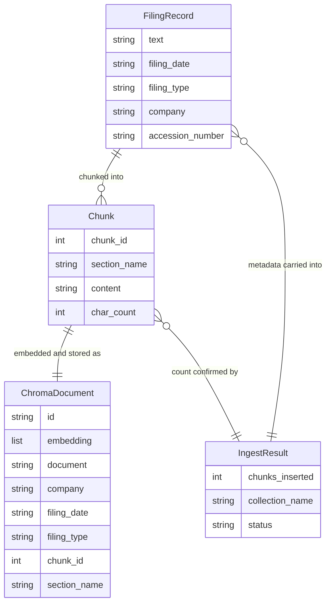

# REASONS Canvas: SEC EDGAR 10-K RAG Ingestion Pipeline
Date: 2026-07-02
Analysis: 2026-07-02-sec-edgar-10k-rag-ingestion-analysis.md
Scope: BE-only

---

## R — Requirements

**Problem:** The pipeline has no way to ingest SEC filings. There is no mechanism to download a 10-K from EDGAR, extract its text, split it into retrievable sections, generate embeddings, or store those embeddings in a vector database. Downstream RAG query features cannot be built until this ingestion foundation exists.

**Goal:** Deliver three new pipeline modules — `data/edgar_client.py`, `data/chunker.py`, and `data/vector_store.py` — that together form a complete 10-K ingestion pipeline: download and clean the filing text, chunk it into labelled sections, embed each chunk, and persist the vectors to a local ChromaDB collection with full metadata. The pipeline returns a confirmation dict with the number of chunks inserted.

**Definition of Done:**

Story 7 — edgar_client:
- [ ] Given a valid ticker "AAPL", when `download_10k("AAPL")` is called, then the returned dict contains exactly five keys: text, filing_date, filing_type, company, accession_number
- [ ] Given a valid ticker, when the EDGAR API returns a filing, then filing_type is exactly "10-K" and filing_date is a valid ISO date string
- [ ] Given a valid ticker, when the filing text is extracted, then text is a non-empty string containing no raw HTML tags
- [ ] Given a valid ticker, when the filing text is extracted, then text length is greater than 10,000 characters
- [ ] Given an invalid ticker, when download_10k is called, then all five values are None and no exception is raised
- [ ] Given the EDGAR API raises any exception, when download_10k is called, then the all-None fallback dict is returned without raising
- [ ] Given any call to download_10k, when the HTTP request is made, then the User-Agent header contains a valid contact email

Story 8 — chunker:
- [ ] Given a valid 10-K text string, when chunk_filing is called, then it returns a non-empty list of dicts
- [ ] Given chunks are returned, when each dict is inspected, then it contains exactly four keys: chunk_id, section_name, content, char_count
- [ ] Given chunks are returned, when chunk_id values are inspected, then they are sequential integers starting at 1 with no gaps
- [ ] Given chunks are returned, when char_count is inspected, then no chunk exceeds max_chars (default 4,000)
- [ ] Given 10-K text containing ITEM 1A and ITEM 7 headings, when chunks are returned, then at least one chunk has section_name "Risk Factors" and at least one has "MD&A"
- [ ] Given a section longer than max_chars, when that section is chunked, then the split occurs at a paragraph boundary, not mid-sentence
- [ ] Given an empty string or None, when chunk_filing is called, then it returns an empty list and does not raise

Story 9 — vector_store:
- [ ] Given a non-empty list of chunks and valid filing metadata, when ingest_chunks is called, then the returned dict contains exactly three keys: chunks_inserted, collection_name, status
- [ ] Given ingestion succeeds, when the result is inspected, then chunks_inserted equals the input list length and status is "ok"
- [ ] Given ingestion succeeds, when the ChromaDB collection is queried, then each stored document's metadata contains all five required fields: company, filing_date, filing_type, chunk_id, section_name
- [ ] Given an empty chunks list, when ingest_chunks is called, then chunks_inserted is 0, status is "ok", and no exception is raised
- [ ] Given ChromaDB or the embedding model raises any exception, when ingest_chunks is called, then chunks_inserted is 0, collection_name is None, status is "error", and no exception is raised
- [ ] Given the same filing is ingested twice, when ingest_chunks is called the second time, then the total vector count does not increase

---

## E — Entities

### Data Entities

The pipeline produces and consumes three data shapes that flow through the three modules in sequence. No relational database is involved — data flows as Python dicts and lists between function calls, with the terminal storage being ChromaDB.

| Entity | Type | Key Fields | Relationships |
|--------|------|-----------|---------------|
| FilingRecord | Output dict of download_10k | text, filing_date, filing_type, company, accession_number | Consumed by chunk_filing (text field) and ingest_chunks (as filing_meta) |
| Chunk | Output dict of chunk_filing (one entry per list item) | chunk_id, section_name, content, char_count | Many per FilingRecord; consumed by ingest_chunks as the chunks list |
| IngestResult | Output dict of ingest_chunks | chunks_inserted, collection_name, status | Terminal confirmation — not consumed by any further module |
| ChromaDocument | Record persisted in ChromaDB | id (accession_number + chunk_id), embedding vector, document text, metadata (company, filing_date, filing_type, chunk_id, section_name) | Stored in a named ChromaDB collection; one per Chunk |

---

## A — Approach

**Pattern:** Module-per-concern, sequential pipeline, exception boundary per module

**Strategy:** Three fully independent modules, each owning one stage of the ingestion pipeline. `data/edgar_client.py` handles the EDGAR HTTP chain and HTML cleaning; `data/chunker.py` handles pure-Python section splitting; `data/vector_store.py` handles embedding and ChromaDB persistence. Each module follows the established pipeline pattern: outer exception boundary, module-level fallback constant (or empty list), private helpers prefixed with underscore. The three modules are wired together by the caller — they do not import each other, preserving the no-cross-module-import rule. No new pip installs are needed for Stories 7 and 8; only Story 9 adds chromadb and sentence-transformers.

**Scope In:**
- `download_10k(ticker)` — 4-step EDGAR HTTP chain: CIK lookup, submissions JSON, filing index page, primary document download and HTML cleaning
- `chunk_filing(text, max_chars)` — regex section boundary detection using _SECTION_PATTERNS, paragraph-boundary splitting of oversized sections, sequential chunk_id assignment
- `ingest_chunks(chunks, filing_meta)` — sentence-transformers embedding, ChromaDB upsert with stable IDs, confirmation dict return
- Explicit pinning of requests, beautifulsoup4, lxml in requirements.txt (currently implicit transitive deps — making them explicit removes the hidden dependency)
- SEC_USER_AGENT and CHROMA_PERSIST_DIR documented in .env.example
- Full test suite for all three modules

**Scope Out:**
- No RAG query or retrieval interface — ingestion only
- No 10-Q, 8-K, or other filing types — 10-K section patterns only
- No cloud vector database (Pinecone, Weaviate, etc.) — ChromaDB local only
- No EDGAR rate limiting or retry logic — single-call, no loop protection
- No batch size optimisation for large filings
- No LLM-assisted chunking — pure regex section detection only
- No integration of the three modules into a single end-to-end orchestration function (separate story)
- No caching or local persistence of downloaded filing HTML

---

## S — Structure

**New Files:**
- `data/edgar_client.py` — public function download_10k, private helpers _clean_html and _get_headers, module-level constant _EMPTY_FILING
- `data/chunker.py` — public function chunk_filing, private helper _split_by_paragraphs, module-level constant _SECTION_PATTERNS
- `data/vector_store.py` — public function ingest_chunks, private helper _build_collection_name, module-level SentenceTransformer model instance and MODEL_NAME constant
- `tests/test_edgar_client.py` — all requests.get calls mocked
- `tests/test_chunker.py` — no mocking (pure Python)
- `tests/test_vector_store.py` — SentenceTransformer and chromadb.PersistentClient mocked

**Modified Files:**
- `requirements.txt` — add explicit pins for requests, beautifulsoup4, lxml; add chromadb and sentence-transformers at pinned versions
- `.env.example` — add SEC_USER_AGENT and CHROMA_PERSIST_DIR entries with descriptive comments

**Database:** ChromaDB on-disk collection at CHROMA_PERSIST_DIR — not a relational database, no migration files needed

---

## O — Operations

1. Update `requirements.txt` to add explicit pins for requests at its currently installed version (2.32.4), beautifulsoup4 at 4.13.5, and lxml at 5.4.0 — making the currently implicit transitive deps explicit and pinned; also add chromadb and sentence-transformers at their latest stable versions compatible with Python 3.9

2. Update `.env.example` to add a SEC_USER_AGENT entry with a comment explaining it must be in the format required by SEC EDGAR fair-access policy (company name followed by a contact email address, space-separated), and a CHROMA_PERSIST_DIR entry with a comment explaining it is the directory path where ChromaDB will persist its on-disk vector index between process restarts

3. Create `data/edgar_client.py` with the _EMPTY_FILING module-level constant (dict with text, filing_date, filing_type, company, accession_number all set to None); the _get_headers private helper that reads SEC_USER_AGENT from the environment (with a safe fallback string) and returns a headers dict for use in all requests calls; the _clean_html private helper that accepts a raw HTML or HTM string, passes it through BeautifulSoup with the lxml parser, calls get_text with a space separator, strips leading and trailing whitespace, collapses multiple consecutive whitespace characters into single spaces, and returns the cleaned plain text string; and the download_10k public function that implements a 4-step EDGAR chain: first calls the EDGAR company search endpoint with the ticker to retrieve the CIK number (returning _EMPTY_FILING.copy() via its own inner try/except if this fails), then calls the EDGAR submissions JSON endpoint at data.sec.gov with the 10-digit zero-padded CIK to find the latest filing where form equals "10-K" and extract its accession number and filing date (returning _EMPTY_FILING.copy() via its own inner try/except if the form list has no 10-K entry), then calls the filing index page at sec.gov to find the primary document filename (returning _EMPTY_FILING.copy() via its own inner try/except if not found), then downloads the primary document and passes it through _clean_html, and finally returns the assembled dict with text, filing_date, filing_type set to "10-K", company from the submissions JSON companyName field, and accession_number — the whole function is wrapped in an outer try/except that returns _EMPTY_FILING.copy() on any uncaught error

4. Create `data/chunker.py` with the _SECTION_PATTERNS module-level dict that maps compiled case-insensitive regex patterns for each standard 10-K item heading (ITEM 1 through ITEM 9A) to their human-readable section names including Business, Risk Factors, Unresolved Staff Comments, Properties, Legal Proceedings, MD&A, Quantitative Disclosures, Financial Statements, Changes in Accountants, and Controls and Procedures; the _split_by_paragraphs private helper that accepts a text string and a max_chars integer and splits the text at double-newline boundaries, yielding sub-chunks where each sub-chunk's length does not exceed max_chars — if a single paragraph is itself longer than max_chars, the paragraph is included as-is (not split mid-sentence); and the chunk_filing public function that guards on empty or None input by returning an empty list immediately, then uses the _SECTION_PATTERNS dict to split the text into named sections by finding the first matching pattern at each position, calls _split_by_paragraphs on any section whose length exceeds max_chars, assigns sequential chunk_id integers starting at 1 across all resulting sub-chunks (not resetting per section), and returns a list of dicts each containing chunk_id, section_name, content, and char_count — the whole function is wrapped in an outer try/except that returns an empty list on any uncaught error

5. Create `data/vector_store.py` with a MODULE_NAME constant set to "all-MiniLM-L6-v2" and a module-level _MODEL instance created by calling SentenceTransformer with that model name (loaded once on import so repeated calls do not reload the model); the _build_collection_name private helper that lowercases the company string, replaces spaces and hyphens with underscores, strips any remaining non-alphanumeric non-underscore characters, and joins it with an underscore and the lowercased filing_type to produce a consistent filesystem-safe collection name such as "apple_10k"; and the ingest_chunks public function that guards on an empty chunks list by returning the confirmation dict with chunks_inserted 0, collection_name from _build_collection_name, and status "ok"; in the non-empty case it initialises a ChromaDB PersistentClient at the path from the CHROMA_PERSIST_DIR environment variable (defaulting to a local ".chroma" directory), gets or creates the named collection, builds stable document IDs as "{accession_number}_{chunk_id}" for every chunk (using filing_meta's accession_number field), encodes all chunk content strings in a single batch call to _MODEL.encode returning a list of lists, assembles the metadata list of dicts containing company, filing_date, filing_type, chunk_id, and section_name for each chunk, calls collection.upsert with the ids, embeddings, documents, and metadatas lists, and returns the confirmation dict with chunks_inserted equal to the input list length, collection_name, and status "ok" — the whole function is wrapped in an outer try/except that returns chunks_inserted 0, collection_name None, status "error" on any uncaught error

6. Create `tests/test_edgar_client.py` with all requests.get calls mocked via unittest.mock.patch at "data.edgar_client.requests.get" — write the following tests: schema test asserting the returned dict has exactly five keys matching the expected set; happy-path test asserting filing_type is "10-K", filing_date is a string matching ISO date format, text is a non-empty string with no angle bracket characters, and text length exceeds 10,000 characters (achieved by setting the mocked primary document response to a string of sufficient length with no HTML tags so _clean_html passes it through); User-Agent assertion test that inspects mock_get.call_args_list and confirms all calls included a User-Agent header value containing a contact email; invalid ticker test where the CIK lookup mock returns an empty result and the function returns all-None dict without raising; network exception test where requests.get raises a ConnectionError and the function returns all-None dict without raising

7. Create `tests/test_chunker.py` with no mocking (pure Python function) — write the following tests: happy-path section detection test using a synthetic 10-K text string containing "ITEM 1A." and "ITEM 7." headings and asserting at least one chunk has section_name "Risk Factors" and at least one has "MD&A"; schema test asserting each returned dict has exactly four keys: chunk_id, section_name, content, char_count; chunk_id sequential test asserting ids form a gapless sequence starting at 1; max_chars enforcement test where a section is constructed to exceed 4,000 characters and all returned chunks are asserted to have char_count at or below 4,000; paragraph-boundary split test where an oversized section contains a double-newline and the function is asserted to split at that boundary rather than mid-word; empty string input returns empty list; None input returns empty list

8. Create `tests/test_vector_store.py` with SentenceTransformer mocked at "data.vector_store._MODEL" and chromadb.PersistentClient mocked at "data.vector_store.chromadb.PersistentClient" — write the following tests: schema test asserting the returned dict has exactly three keys; happy-path test asserting chunks_inserted equals the number of chunks passed in and status is "ok"; upsert-not-add test asserting the mock collection's upsert method was called and the add method was not called (proving idempotency mechanism is in place); metadata test asserting the metadatas argument passed to upsert contains all five required metadata keys for each chunk; empty list test asserting chunks_inserted is 0 and status is "ok"; ChromaDB exception test where the mock client raises and the function returns chunks_inserted 0 status "error" without raising; embedding exception test where _MODEL.encode raises and the function returns chunks_inserted 0 status "error" without raising

---

## N — Norms

### Pipeline Norms

- Module-per-concern: each file in data/ owns one concern and exposes one or two public functions; edgar_client owns EDGAR retrieval, chunker owns text splitting, vector_store owns embedding and persistence
- All public functions must have an outer exception boundary — none of the three functions may raise to their caller under any circumstances
- Return types: download_10k returns a dict, chunk_filing returns a list (empty list is the fallback, not None), ingest_chunks returns a dict
- Module-level constants define fallback shapes — _EMPTY_FILING as an all-None dict, _SECTION_PATTERNS as the section mapping dict; always return _EMPTY_FILING via .copy()
- Private helpers are prefixed with underscore: _clean_html, _get_headers, _split_by_paragraphs, _build_collection_name
- No cross-module imports in the data/ layer — edgar_client, chunker, and vector_store must not import each other
- All external HTTP calls and all SDK calls (ChromaDB, SentenceTransformer) must be mocked in tests — no live network calls in the test suite
- Python 3.9 compatible — no bare X or Y union type hints; use string annotations or Union from typing
- Pin all new dependencies in requirements.txt — no floating specifiers; chromadb and sentence-transformers are fast-moving packages

---

## S — Safeguards

### Pipeline Safeguards

- Never let an EDGAR HTTP error, a ChromaDB exception, or a sentence-transformers error propagate past the module boundary — every external call must be covered by try/except
- Use ChromaDB upsert (not add) for all vector insertions — using add would fail on duplicate IDs on re-ingestion and would violate the idempotency AC
- _SECTION_PATTERNS regex patterns must use case-insensitive matching — EDGAR filings capitalise section headers inconsistently across companies and years; a case-sensitive match will miss valid sections
- The sentence-transformers model must be mocked at the module level in tests — SentenceTransformer downloads approximately 90MB on first use; any test that triggers a real model load will be slow and will fail in offline environments
- Do not hardcode the SEC_USER_AGENT contact email — read it from the environment variable; hardcoding violates the no-hardcoded-values norm and exposes a personal email in source code
- The primary document filename must be discovered from the EDGAR filing index page, not assumed — do not hardcode or guess the filename extension; some filings use .htm, some .txt, and some have multi-document packages
- _EMPTY_FILING must never be mutated — always return .copy(); mutations to the returned dict must not corrupt the module-level constant
- Pin requests, beautifulsoup4, and lxml explicitly in requirements.txt even though they are currently installed as transitive openbb dependencies — if openbb is uninstalled or updated, these implicit deps would vanish and break edgar_client silently
- Do not assume CHROMA_PERSIST_DIR exists on disk — ChromaDB creates it if absent, but if the path is on a read-only mount the outer try/except must catch and return the error fallback

---

## Change Log

[Appended by /prompt-update and /sync]
