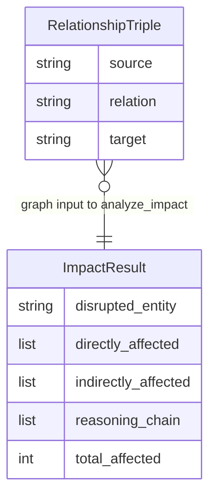

# REASONS Canvas: Supply Chain Impact Analysis
Date: 2026-07-02
Analysis: 2026-07-02-supply-chain-impact-analysis-analysis.md
Scope: BE-only

---

## R — Requirements

**Problem:** The pipeline can extract financial relationships from text as typed triples (Story 12), but has no capability to reason over those triples as a graph. A caller who knows that TSMC is a SUPPLIER to NVIDIA and NVIDIA is a SUPPLIER to Microsoft cannot ask the pipeline "if TSMC is disrupted, which companies are affected and why?" — there is no function that traverses the relationship graph, classifies affected entities by proximity, or explains the propagation chain.

**Goal:** Deliver one new pipeline module — `data/graph_reasoning.py` — that accepts a list of relationship triples (the output format of `extract_relationships`) and a disrupted entity name, traverses the graph using breadth-first search, classifies each discovered entity as directly or indirectly affected, and returns a structured five-key dict with the affected entities and a human-readable reasoning chain explaining how disruption propagates through the graph.

**Definition of Done:**
- [ ] Given the graph containing TSMC→SUPPLIER→NVIDIA, TSMC→SUPPLIER→AMD, and NVIDIA→SUPPLIER→Microsoft, and disrupted entity "TSMC", when `analyze_impact` is called, then `directly_affected` contains "NVIDIA" and "AMD", `indirectly_affected` contains "Microsoft", and `total_affected` is 3
- [ ] Given the same TSMC graph, when `reasoning_chain` is inspected, then it contains exactly 3 entries and the Microsoft entry references the path through NVIDIA
- [ ] Given a successful call, when the returned dict is inspected, then it contains exactly five keys: disrupted_entity, directly_affected, indirectly_affected, reasoning_chain, total_affected
- [ ] Given a disrupted entity that does not appear as a source in any triple, when `analyze_impact` is called, then directly_affected and indirectly_affected are empty lists, reasoning_chain is an empty list, total_affected is 0, and no exception is raised
- [ ] Given an empty graph list, when `analyze_impact` is called, then the function returns the safe fallback dict without raising
- [ ] Given a graph containing a malformed triple missing the source key, when `analyze_impact` is called, then the malformed triple is skipped and valid triples are still processed correctly
- [ ] Given a graph with a cycle such as A → B → C → A, when `analyze_impact` is called with disrupted entity "A", then B and C are returned as affected and the function terminates without looping
- [ ] Given total_affected is inspected, when compared against the sum of len(directly_affected) and len(indirectly_affected), then the values are equal

---

## E — Entities

### Data Entities

The module produces one data shape. An ImpactResult is the terminal output of the analysis function — a plain Python dict, not a database row or class instance. The directly_affected and indirectly_affected fields are flat lists of entity name strings; the reasoning_chain field is a flat list of explanation strings, one per affected entity, in BFS discovery order.

| Entity | Type | Key Fields | Relationships |
|--------|------|-----------|---------------|
| RelationshipTriple | Input dict (one entry per graph list item) | source (str), relation (str), target (str) — confidence is present in extract_relationships output but not used during traversal | Consumed as the graph argument; many per call |
| ImpactResult | Output dict | disrupted_entity (str), directly_affected (list[str]), indirectly_affected (list[str]), reasoning_chain (list[str]), total_affected (int) | One per call; terminal output |

---

## A — Approach

**Pattern:** Pure algorithmic module — BFS with parent-pointer tracking, adjacency list, `_EMPTY_RESULT` factory, outer exception boundary

**Strategy:** `data/graph_reasoning.py` is the pipeline's first purely algorithmic module — no LLM call, no external library, no network I/O. The implementation has two passes. First, build an adjacency list from the validated triples in O(n), skipping any triple with missing or non-string keys. Second, run BFS from `disrupted_entity` using `collections.deque` — but unlike standard BFS which tracks only visited/unvisited, each visited node is recorded in a `visited` dict that stores its depth (1 = directly affected, 2+ = indirectly affected), its parent node, and the relation used to reach it. After BFS completes, walk the `visited` dict to assemble `directly_affected`, `indirectly_affected`, and `reasoning_chain` in discovery order. BFS is chosen over DFS because it guarantees each node is first reached via the shortest path — DFS could reach a depth-1 node via a longer indirect path and misclassify it as indirectly affected. Cycle safety is a free property of BFS: each node is enqueued at most once, so cycles never cause infinite traversal. The `_EMPTY_RESULT` helper is a one-argument factory function (not a module-level constant) because the fallback dict must carry the caller-supplied `disrupted_entity` value, which is unknown at module load time.

**Scope In:**
- `analyze_impact(graph: list, disrupted_entity: str) -> dict` — adjacency list build, BFS traversal, entity classification, reasoning chain construction
- `_EMPTY_RESULT(disrupted_entity: str) -> dict` — private factory returning the 5-key safe fallback dict
- `tests/test_graph_reasoning.py` — 8 pure Python tests, no mocking, no external calls

**Scope Out:**
- No LLM call — the reasoning chain is constructed programmatically from graph structure, not generated by a language model
- No relation-type filtering — all edge types (SUPPLIER, CUSTOMER, PARTNER, etc.) are traversed equally
- No reverse traversal — only forward edges (source → target) are followed
- No confidence-score weighting — edges are included or excluded based on schema validity only
- No multi-entity disruption — exactly one disrupted_entity per call
- No persistence or graph database — purely in-memory over the passed list
- No cross-module import — graph_reasoning.py must not import from knowledge_graph.py or any other data module

---

## S — Structure

**Module:** `data/` (Python pipeline, target: Z:\claude\stock_analyzer)

**New Files:**
- `data/graph_reasoning.py` — public function analyze_impact, private factory _EMPTY_RESULT, adjacency list builder, BFS traversal with parent-pointer tracking
- `tests/test_graph_reasoning.py` — 8 pure pytest functions; named module-level graph fixtures; no mocking; no sys.modules injection needed

**Modified Files:** None — requirements.txt, .env.example, and all existing data modules require no changes

**Database:** None

---

## O — Operations

1. Create `data/graph_reasoning.py` with a private `_EMPTY_RESULT(disrupted_entity)` factory function that accepts a single string argument and returns a dict with exactly five keys — disrupted_entity set to the argument, directly_affected set to an empty list, indirectly_affected set to an empty list, reasoning_chain set to an empty list, and total_affected set to the integer 0; this factory is called at every failure and early-return point in the module so the caller always receives the correct 5-key schema; then an adjacency-list builder implemented as an inline helper inside the public function that iterates the graph argument and for each item checks that it is a dict and that the source, relation, and target keys each exist and hold non-empty string values after stripping, and if valid appends a tuple of (relation, target) to the list stored at the source key of a defaultdict-or-plain-dict, silently skipping any item that fails validation; then the public `analyze_impact(graph: list, disrupted_entity: str) -> dict` function that first validates its inputs — if disrupted_entity is not a string or is empty or whitespace-only return _EMPTY_RESULT(disrupted_entity), if graph is not a list or is empty return _EMPTY_RESULT(disrupted_entity) — then inside an outer try/except Exception that returns _EMPTY_RESULT(disrupted_entity) on any uncaught error, builds the adjacency list from graph, initialises BFS with a collections.deque containing only the disrupted_entity as the starting node, initialises a visited dict that will map each discovered node to a tuple of (depth: int, parent_node: str or None, relation_used: str or None), marking the disrupted_entity itself as visited with depth 0 and no parent before the BFS loop begins, then runs the BFS loop: dequeue the current node, look up its neighbours in the adjacency list (if none, skip), and for each (relation, target) neighbour pair where target is not already in the visited dict, record target in visited as (current_depth + 1, current_node, relation) and enqueue target; after the BFS loop, iterate the visited dict in insertion order and for each node where depth is greater than 0 (excluding the disrupted_entity itself), build the reasoning chain string and classify the node: for depth-1 nodes the string is "{target} is directly affected: {disrupted_entity} is a {RELATION} to {target}" and the node is appended to directly_affected; for depth 2 or greater, reconstruct the full path by walking parent pointers from target back to disrupted_entity collecting (node, relation) pairs in reverse, then format the string as "{target} is indirectly affected via {parent}: {path description}" where the path description lists each hop as "{A} is a {RELATION} to {B}" joined by ", and ", and the node is appended to indirectly_affected; finally return a dict with disrupted_entity set to the input string, directly_affected and indirectly_affected as built, reasoning_chain as the list of all reasoning strings in the order they were added, and total_affected set to len(directly_affected) + len(indirectly_affected)

2. Create `tests/test_graph_reasoning.py` importing only `analyze_impact` from `data.graph_reasoning`, with no mocking, no patch decorators, no sys.modules injection; define the following module-level fixture constants: a main graph constant named _GRAPH containing the four-triple list from the story — TSMC→SUPPLIER→NVIDIA, TSMC→SUPPLIER→AMD, NVIDIA→SUPPLIER→Microsoft — as a list of dicts each with source, relation, and target keys; a cyclic graph constant named _CYCLIC_GRAPH containing A→DEPENDENCY→B, B→DEPENDENCY→C, C→DEPENDENCY→A as a list of dicts; a malformed-mixed graph constant named _MIXED_GRAPH containing one valid triple (TSMC→SUPPLIER→NVIDIA) and one dict missing the source key; write the following tests calling analyze_impact directly with no mocking: a schema test asserting the returned dict has exactly five keys matching the expected set; a direct-and-indirect classification test using _GRAPH and disrupted entity "TSMC" asserting that directly_affected contains both "NVIDIA" and "AMD", indirectly_affected contains "Microsoft", and total_affected equals 3; a reasoning chain count test asserting len(reasoning_chain) equals 3; a reasoning chain content test asserting the Microsoft entry in reasoning_chain contains the substring "NVIDIA" proving the indirect path is described; an entity-not-in-graph test using _GRAPH and disrupted entity "Apple" asserting directly_affected and indirectly_affected are empty lists, reasoning_chain is an empty list, total_affected is 0, and no exception is raised; an empty graph test asserting analyze_impact([], "TSMC") returns directly_affected equals empty list and total_affected equals 0 without raising; a malformed triple skipped test using _MIXED_GRAPH and disrupted entity "TSMC" asserting directly_affected contains "NVIDIA" (the valid triple was processed) and total_affected equals 1 (the malformed triple did not produce a phantom result); a cycle test using _CYCLIC_GRAPH and disrupted entity "A" asserting directly_affected contains "B" and indirectly_affected contains "C" and the function returns without hanging (the test completing is proof of cycle safety); a total_affected arithmetic test asserting total_affected equals len(directly_affected) plus len(indirectly_affected) for the TSMC happy-path result

---

## N — Norms

### Pipeline Norms

- Module-per-concern: graph_reasoning.py owns supply-chain impact analysis via graph traversal — it does not import from knowledge_graph.py, sentiment.py, rag_answer.py, or any other data module
- All public functions must have an outer exception boundary — analyze_impact must never raise to its caller under any circumstances
- Return type: analyze_impact always returns a dict with exactly five keys — never None, never a list, never a partial schema
- The safe fallback must be a factory function (not a module-level constant) because the caller-supplied disrupted_entity value must be carried in the fallback dict
- Private helpers and factories prefixed with underscore: _EMPTY_RESULT
- No external library dependencies — use only Python standard library (collections.deque)
- Python 3.9 compatible — no bare X or Y union type hints, no walrus operator in conditions that require 3.9 compatibility
- Tests are pure pytest functions: no mocking, no @patch decorators, no class hierarchy — same style as test_chunker.py and test_screener.py

---

## S — Safeguards

### Pipeline Safeguards

- Never let any exception propagate past the module boundary — the outer try/except catches everything and returns _EMPTY_RESULT(disrupted_entity)
- Use BFS (not DFS) for traversal — DFS can reach a node via a longer path before a shorter one, incorrectly classifying a depth-1 (directly affected) entity as depth-2+ (indirectly affected); BFS guarantees shortest-path-first discovery
- The visited dict must be checked before enqueueing each neighbour — if a node is already in visited, do not enqueue it again; this is the cycle-safety mechanism and must not be omitted
- The adjacency list builder must validate each triple before adding it — skip any item that is not a dict, or where source, relation, or target is missing or not a non-empty string; malformed triples must never reach the BFS loop
- _EMPTY_RESULT must be called as a function with the disrupted_entity argument at every failure point — do not return a bare dict literal inline, as mismatched schemas between fallback paths are hard to catch in tests
- total_affected must be computed as len(directly_affected) + len(indirectly_affected) after the BFS result lists are finalised — never maintained as a separate counter during traversal, as counters and list lengths can diverge if the lists are modified after counting
- The disrupted_entity node itself must not appear in directly_affected or indirectly_affected — initialise the visited dict with the disrupted_entity at depth 0 before BFS begins so it is never re-enqueued as a neighbour of itself

---

## Change Log

[Appended by /prompt-update and /sync]
