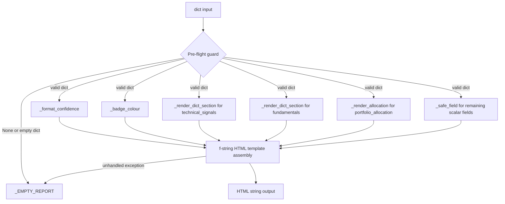

# REASONS Canvas: Basic UI Report Dashboard
Date: 2026-07-04
Analysis: 2026-07-04-basic-ui-report-dashboard-analysis.md
Scope: BE-only

---

## R — Requirements

**Problem:** The pipeline produces rich analytical outputs across 20 modules (recommendation, confidence, risk, portfolio weights, sentiment, fundamentals) but there is no way to present those outputs in a human-readable format. All results are raw Python dicts that require a developer to interpret.

**Goal:** Implement `render_report(data)` in `data/report.py` — a pure Python function that accepts a pre-assembled dict of nine pipeline fields and returns a self-contained HTML string suitable for saving to a file and opening in any browser, with no server or external dependency required.

**Definition of Done:**
- [ ] Given a fully populated data dict with all nine keys, when `render_report(data)` is called, then it returns a non-empty HTML string that contains the string value of every field
- [ ] Given the returned HTML string is saved to a file and opened in a browser, then each of the nine sections is visually distinct, labelled, and readable without any framework or server
- [ ] Given a data dict where one or more field values are None, when `render_report(data)` is called, then each None field renders as the literal text "N/A" and all other fields render normally
- [ ] Given None or an empty dict as input, when `render_report(data)` is called, then it returns a minimal fallback HTML page containing the message "No data available" and does not raise any exception
- [ ] Given a confidence_score float in the range zero to one, when rendered, then the value is displayed as a whole-number percentage (for example 0.85 becomes 85%)
- [ ] Given a recommendation value of BUY, SELL, or HOLD (any casing), when rendered, then the badge background colour is green, red, or amber respectively
- [ ] Given a portfolio_allocation dict mapping ticker strings to weight floats, when rendered, then each ticker and its corresponding percentage is listed in the output

---

## E — Entities

### Module Artifacts

| Artifact | Type | Responsibility |
|----------|------|----------------|
| `data/report.py` | New Python module | Sole module responsible for HTML presentation; exposes one public function |
| `render_report(data)` | Public function — returns str | Accepts a nine-key dict; returns a self-contained HTML string; never raises |
| `_EMPTY_REPORT` | Module-level string constant | Minimal fallback HTML page returned on None input, empty dict, or unhandled exception |
| `_safe_field(value)` | Private helper | Normalises any scalar field to a display string; None becomes "N/A", floats are formatted, strings pass through |
| `_format_confidence(score)` | Private helper | Converts a float in zero-to-one to a percentage string; clamps out-of-range values; None becomes "N/A" |
| `_badge_colour(recommendation)` | Private helper | Maps BUY to green, SELL to red, HOLD to amber, unknown to grey; normalises input to uppercase before lookup |
| `_render_allocation(alloc)` | Private helper | Converts a ticker-to-weight dict to an HTML unordered list with percentage-formatted weights; None or empty dict becomes "N/A" |
| `_render_dict_section(d)` | Private helper | Converts a one-level dict (such as fundamentals or technical_signals) to an HTML definition list; None values per entry become "N/A" |
| `tests/test_report.py` | New test file | Pure Python, no mocking; seven test classes targeting all seven acceptance criteria |

---

## A — Approach

**Pattern:** Pure Python string formatting — no web framework, no external packages, stdlib only.

**Strategy:** `render_report` operates in two phases. First, a pre-flight guard immediately returns `_EMPTY_REPORT` for None or empty-dict inputs before any template logic runs. Second, five private helpers each normalise one category of field into a safe display string, and their outputs are composed into a single f-string HTML template containing an inline style block. An outer try-except wraps the entire second phase so that no malformed upstream data can propagate an exception to the caller. Because the return type is `str` rather than `dict`, this module is the only one in the codebase with a string-type fallback constant — the docstring must document this explicitly.

**Scope In:**
- New file `data/report.py` with one public function and five private helpers
- One string-type module-level constant `_EMPTY_REPORT`
- Self-contained HTML output with inline CSS only
- Colour-coded recommendation badge (BUY green, SELL red, HOLD amber)
- Confidence score displayed as a whole-number percentage
- Portfolio allocation rendered as a labelled list of ticker and weight percentage
- Nested dict fields (fundamentals, technical_signals) rendered as one-level key-value definition lists
- New test file `tests/test_report.py` with no mocking

**Scope Out:**
- No live or interactive dashboard (no Flask, no FastAPI, no WebSockets)
- No PDF or CSV export
- No chart or graph rendering
- No real-time data refresh
- No authentication or session handling
- No Markdown output variant
- No imports from any other data module — caller assembles the dict
- No normalisation of portfolio weights — display as received

---

## S — Structure

**Module directory:** `Z:\claude\stock_analyzer\data\`

**New Files:**
- `data/report.py` — module containing `_EMPTY_REPORT`, five private helpers, and `render_report(data)`
- `tests/test_report.py` — seven test classes, no mocking, all targeting the seven acceptance criteria

**Modified Files:**
- None — no existing module requires any change

**Database:**
- None — this module is pure string transformation with no persistence

---

## O — Operations

1. Create `data/report.py` and define the module-level string constant `_EMPTY_REPORT` as a minimal self-contained HTML page containing the text "No data available" and a basic inline style block

2. Implement `_safe_field(value)` — accepts any value; if the value is None returns the string "N/A"; if the value is a float formats it to two decimal places; otherwise returns str of the value, applying html.escape to prevent any markup injection from upstream string data

3. Implement `_format_confidence(score)` — if score is None or non-numeric returns "N/A"; clamps the float to the range zero to one; multiplies by 100 and returns the result as a whole number followed by a percent sign (for example 85%)

4. Implement `_badge_colour(recommendation)` — normalises the input to uppercase string; looks up BUY in a constant mapping to the hex code for green, SELL to red, HOLD to amber; returns the grey hex code for any unknown value; the colour mapping is a module-level constant dict named `_BADGE_COLOURS`

5. Implement `_render_allocation(alloc)` — if alloc is None or an empty dict returns the string "N/A"; iterates the ticker-to-weight dict and builds an HTML unordered list where each list item shows the ticker followed by the weight multiplied by 100 formatted to one decimal place and a percent sign

6. Implement `_render_dict_section(d)` — if d is None or not a dict returns the string "N/A"; iterates the dict and builds an HTML definition list where each term is the key and each definition is the value converted via `_safe_field`; inner dict values are rendered as their string representation without further recursion

7. Implement `render_report(data)` — the single public function; first runs the pre-flight guard returning `_EMPTY_REPORT` directly for None or empty dict input; then inside a try block calls all five helpers to prepare the nine display values; assembles a single f-string HTML document with an inline style block that sets a readable font, constrained max-width, card-style section borders, and the recommendation badge background colour; the outer except clause returns `_EMPTY_REPORT`; the function is annotated with a one-line docstring noting it returns str (not dict) and never raises

8. Create `tests/test_report.py` with seven test classes in this order: `TestOutputSchema` (result is a str, HTML structural tags present), `TestHappyPath` (all nine field values appear in the output), `TestConfidenceFormatting` (0.85 to "85%", 1.0 to "100%", 0.0 to "0%", None to "N/A"), `TestRecommendationBadge` (BUY maps to green hex, SELL to red hex, HOLD to amber hex, lowercase "buy" to green hex, unknown value to grey hex), `TestNoneFieldFallback` (each of the nine keys set to None individually produces "N/A" in the output), `TestPortfolioAllocation` (AAPL at 0.5 and MSFT at 0.3 both appear as ticker and percentage, None produces "N/A", empty dict produces "N/A"), `TestPreflightGuard` (None input returns a str containing "No data available" without raising, empty dict input returns a str containing "No data available" without raising)

---

## N — Norms

### Python Pipeline Norms

- Module-per-concern: one public function per module in `data/`; helpers are private and prefixed with underscore
- Exception boundary: every public function wraps its logic in an outer try-except Exception that never propagates exceptions to the caller
- Fallback constant: define a module-level constant for the empty or error return value; return it directly (no `.copy()` for string type)
- Return Python-native types only: no numpy scalars, no pandas objects, no dataclass instances
- No cross-module imports within `data/`: each module is self-contained; callers outside `data/` assemble inputs
- All private helpers prefixed with underscore; no module-level state other than constants
- stdlib only for this module: no new packages added to requirements.txt
- Tests use `unittest.TestCase` class groupings run via `& "Z:\python39\python.exe" -m pytest tests/ -v`
- Pure-Python modules (no external calls) use no mocking in tests — call the function directly and assert on return values
- Test naming: `test_<what>_<condition>` (for example `test_confidence_none_returns_na`)

---

## S — Safeguards

### Pipeline Safeguards

- Never modify any existing module in `data/` — this story creates one new file only
- Never raise from `render_report` — the outer try-except must cover the entire rendering path including helper calls
- Apply `html.escape()` to every user-provided string value before inserting it into the HTML template to prevent markup injection from upstream string data
- `_EMPTY_REPORT` is a string constant — it is immutable; return it directly without `.copy()`
- Normalise `recommendation` to uppercase inside `_badge_colour` before looking up the colour map — do not require callers to normalise
- Clamp `confidence_score` to the range zero to one inside `_format_confidence` before percentage conversion — never display a value above 100% or below 0%
- Do not add any import from another `data/` module — `render_report` must remain independently testable without the full pipeline installed
- Do not add any entry to `requirements.txt` — this module uses stdlib only
- Verify all 399 existing tests still pass after adding the new module

---

## Change Log

Canvas created 2026-07-04 from analysis 2026-07-04-basic-ui-report-dashboard-analysis.md.
