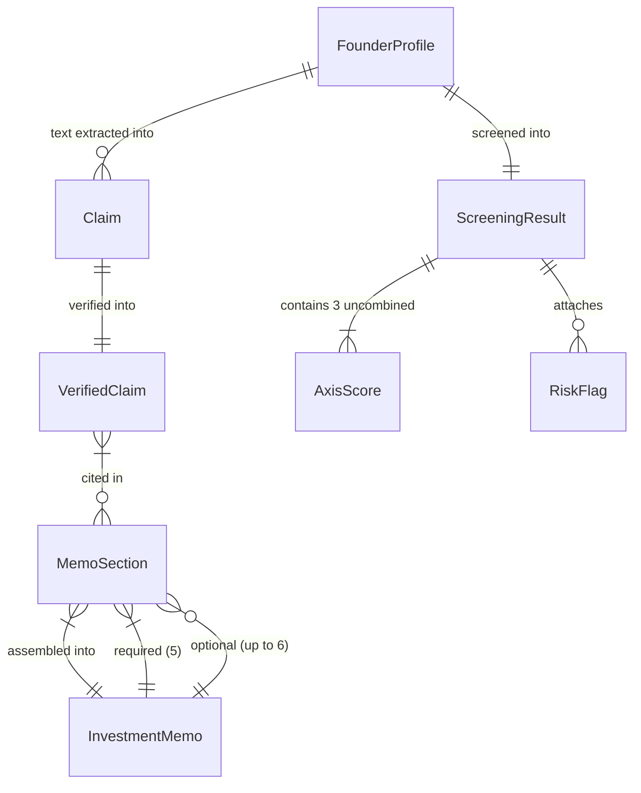

# REASONS Canvas: VC Brain — Trust Score & Evidence-Backed Investment Memo
Date: 2026-07-19
Analysis: vc-brain-trust-score-memo-analysis.md
Scope: BE-only

---

## R — Requirements

**Problem:** The decision engine's `generate_memo()` produces flat prose with no claim traceability, no trust confidence levels, and no distinction between fabricated inference and evidence-backed assertions. `InvestmentMemo` has no structured way to flag missing sections as "not disclosed" — optional sections are simply absent. There is no claim extraction layer and no cross-verification against available GitHub/pitch deck signals.

**Goal:** Create `data/trust_score.py` with `extract_claims()` and `verify_claim()` backed by the `knowledge_graph.py` Ollama pattern, and rewrite `data/memo_generator.py` with a `MemoSection`-based `InvestmentMemo` v2, `generate_memo(profile, ScreeningResult, verified_claims)`, `export_memo_markdown()`, and `export_memo_pdf()`. Every claim in the memo must trace to a `VerifiedClaim`. Every missing optional section must be explicitly marked "not disclosed", never silently omitted or fabricated.

**Definition of Done:**
- [ ] Given a `FounderProfile` with pitch deck text containing "We have 500K active users" in `raw_sources`, when `extract_claims()` is called, then the returned list contains a `Claim` with `category="traction"`, `claim_text` referencing "500K", and `confidence_score > 0.5`
- [ ] Given a `Claim` asserting "500K users" and `available_evidence` containing a signal with `star_growth` score ≤ 10, when `verify_claim()` is called, then `status == "contradicted"` and `contradiction_note` is a non-empty string
- [ ] Given a claim about cap table structure with no supporting data in `available_evidence`, when `verify_claim()` is called, then `status == "unverifiable"` and the `VerifiedClaim` is returned (not dropped or None)
- [ ] Given a `FounderProfile` whose `raw_sources` contains no revenue information, when `extract_claims()` is called, then the returned list contains a `Claim` with `claim_text` containing "not disclosed" for the revenue category
- [ ] Given profile signals showing `contributor_count=3` and a team claim "a team of 3 engineers", when `verify_claim()` is called, then `status == "verified"` and `supporting_evidence` references the contributor signal
- [ ] Given Ollama is unavailable (mocked `ConnectionError`), when `extract_claims()` is called, then it does not raise and returns a list containing at least the "not disclosed" gap-flag claims
- [ ] Given a `FounderProfile`, a `ScreeningResult`, and a list of `VerifiedClaim` objects, when `generate_memo()` is called, then `InvestmentMemo.required_sections` contains exactly 5 sections, each with non-empty content and non-empty `claims`
- [ ] Given a profile with no revenue `VerifiedClaim` objects, when `generate_memo()` is called, then the optional Financials section has `is_available=False` and `unavailability_reason` contains "not disclosed"
- [ ] Given the generated `InvestmentMemo`, when `export_memo_markdown()` is called, then the output contains the literal text "not disclosed" for each section with `is_available=False` and contains no revenue figures absent from a `VerifiedClaim`
- [ ] Given any required `MemoSection`, when its `claims` list is inspected, then it is non-empty — the empty-claims guard prevents unsourced sections
- [ ] Given a valid `InvestmentMemo`, when `export_memo_pdf()` is called, then it returns a `bytes` object with length > 0 without raising
- [ ] Given Sofia/DeployKit from `sample_founders.json` processed end-to-end, when `export_memo_markdown()` is called, then the output contains all 5 required section headings, a trust score header, and at least one "not disclosed" label on a missing optional section
- [ ] Given existing tests in `test_memo_generator.py` that test the v1 `generate_memo(profile, thesis_result, risk_flags, decision)` interface, when the full test suite runs after the v2 rewrite, then the replaced test file tests the v2 interface only

---

## E — Entities

### Data Entities

| Entity | Type | Key Fields | Relationships |
|--------|------|-----------|---------------|
| `Claim` | New dataclass — `trust_score.py` | claim_text (str), category (Literal traction/revenue/team/market_size/other), confidence_score (float 0-1), source_reference (str) | Wrapped by `VerifiedClaim`; produced by `extract_claims()`; consumed by `verify_claim()` |
| `VerifiedClaim` | New dataclass — `trust_score.py` | claim (Claim), status (Literal verified/unverifiable/contradicted), verification_confidence (float 0-1), supporting_evidence (list[str]), contradiction_note (str or None — default None) | Contained in `MemoSection.claims`; produced by `verify_claim()`; input to `generate_memo()` |
| `MemoSection` | New dataclass — `memo_generator.py` | title (str), content (str), claims (list[VerifiedClaim]), is_available (bool), unavailability_reason (str or None) | Contained in `InvestmentMemo.required_sections` (5 items) and `optional_sections` (up to 6 items) |
| `InvestmentMemo` (v2) | Replaces existing — `memo_generator.py` | company (str), date (str), required_sections (list[MemoSection] — exactly 5), optional_sections (list[MemoSection] — up to 6), overall_trust_score (float 0-1) | Produced by `generate_memo()`; consumed by `export_memo_markdown()` and `export_memo_pdf()` |
| `FounderProfile` | Existing — `founder_data.py` | name, company, sector, stage, github_url, key_signals (dict), raw_sources (list[str]) | Input to `extract_claims()` and `generate_memo()` |
| `ScreeningResult` | Existing — `scoring_engine.py` | profile, founder_axis, market_axis, idea_vs_market_axis (AxisScore), risk_flags (list[RiskFlag]), thesis_match, thesis_reason | Input to `generate_memo()` v2; replaces `DecisionResult` in the memo pipeline |
| `AxisScore` | Existing — `decision_engine.py` | name, score, trend, rationale, evidence (list[str]) | Evidence strings populate Investment Hypotheses and SWOT in `generate_memo()` |
| `RiskFlag` | Existing — `risk_flags.py` | category, description, severity | Feeds SWOT weaknesses and threats in `generate_memo()` |

---

## A — Approach

**Pattern:** Two new pure data-layer modules following the same stateless-function pattern as all other `data/*.py` modules. One LLM-dependent function (`extract_claims()`) with offline fallback; all remaining functions are rule-based and offline-safe. The claim extraction pattern is adapted directly from `knowledge_graph.py` with a VC-specific system prompt and output schema. `generate_memo()` is assembly-only — no Ollama call — making the "no fabricated data" guarantee structurally enforced rather than aspirational.

**Strategy:** `data/trust_score.py` replicates the `_call_ollama()` / `_parse_llm_response()` pattern from `knowledge_graph.py` with a new system prompt requesting `{claim_text, category, confidence_score, source_reference}` tuples instead of entity-relation triples. `verify_claim()` is purely rule-based using `available_evidence` (signal dicts from `generate_founder_signals()`) — no Ollama needed. `data/memo_generator.py` is a targeted v2 rewrite: the flat-string `InvestmentMemo` is replaced with the `MemoSection`-based structure; `generate_memo()` changes signature to `(profile, ScreeningResult, verified_claims)` and assembles sections from structured inputs only. The 10 existing `test_memo_generator.py` tests are replaced in the same operation as the rewrite to prevent a broken intermediate state.

**Scope In:**
- `data/trust_score.py` — new module with `Claim`, `VerifiedClaim`, `extract_claims()`, `verify_claim()`
- `_GAP_SECTIONS` constant covering the three mandatory-flag categories: cap_table, financials, revenue
- `data/memo_generator.py` v2 — `MemoSection`, `InvestmentMemo` v2, `generate_memo()` v2, `export_memo_markdown()`, `export_memo_pdf()`
- `reportlab` added to `requirements.txt`
- `tests/test_trust_score.py` — full test suite for all trust_score ACs
- `tests/test_memo_generator.py` — full replacement of v1 tests with v2 tests
- `NOT_DISCLOSED` sentinel constant preserved in `memo_generator.py`

**Scope Out:**
- Real-time external verification APIs (Crunchbase, LinkedIn, Companies House)
- Claim deduplication logic — preserve all claims including overlapping ones
- Re-extraction from PDF binary — plain text `raw_sources` strings only; `export_memo_pdf()` uses `reportlab` not PyPDF2
- Multi-founder comparison memos
- Email delivery or file-system persistence of exported memos
- Flask route integration (`/memo` endpoint) — function-layer only
- LLM prose generation inside `generate_memo()` — assembly from structured data only
- Modifying `knowledge_graph.py`, `founder_data.py`, `scoring_engine.py`, or `decision_engine.py`

---

## S — Structure

**Module directory:** `D:\claude\project\vc-brain\data\`

**New Files:**
- `data/trust_score.py` — `Claim`, `VerifiedClaim` dataclasses; `extract_claims()`, `verify_claim()` functions; `_GAP_SECTIONS` constant; `_call_ollama_for_claims()` internal helper
- `tests/test_trust_score.py` — full pytest suite for all trust_score ACs; all Ollama calls mocked via `@patch("data.trust_score.requests.post", ...)`

**Modified Files:**
- `data/memo_generator.py` — complete v2 rewrite: `MemoSection`, `InvestmentMemo` v2 dataclasses; `generate_memo()` v2; `export_memo_markdown()`; `export_memo_pdf()`; `NOT_DISCLOSED` constant preserved; all v1 code removed
- `tests/test_memo_generator.py` — all 10 v1 tests removed; v2 tests written in their place
- `requirements.txt` — `reportlab>=4.0` appended

**No database migrations** — no schema changes; all data is in-memory or in existing JSON files.

---

## O — Operations

1. Add `reportlab>=4.0` to `requirements.txt` — append one line; this must precede all operations that implement or test `export_memo_pdf()` so the import does not fail.

2. Create `data/trust_score.py` skeleton — module docstring; imports (`dataclasses`, `json`, `logging`, `os`, `re`, `requests`, `typing`); `_OLLAMA_URL` and `_OLLAMA_MODEL` constants from environment variables with same defaults as `knowledge_graph.py`; `_CLAIM_CATEGORIES = frozenset({"traction", "revenue", "team", "market_size", "other"})`; `_GAP_SECTIONS = ["cap_table", "financials", "revenue"]` — these three sections must always be gap-flagged if absent; `logger = logging.getLogger(__name__)`.

3. Add `Claim` and `VerifiedClaim` dataclasses to `data/trust_score.py` — `Claim` has `claim_text (str)`, `category (str)`, `confidence_score (float)`, `source_reference (str)`; `VerifiedClaim` has `claim (Claim)`, `status (str)`, `verification_confidence (float)`, `supporting_evidence (list[str])` with default empty list, `contradiction_note (str or None)` with default None. Both use `field(default_factory=...)` for mutable defaults.

4. Add `extract_claims(profile)` to `data/trust_score.py` — internal `_call_ollama_for_claims(text)` replicates the `knowledge_graph.py` Ollama call pattern with a VC-oriented system prompt: instructs the model to extract all factual claims from the text as a JSON array of `{claim_text, category, confidence_score, source_reference}` where category must be one of the five in `_CLAIM_CATEGORIES` and confidence_score is 0.0 to 1.0; fence-stripping and JSON array parsing follows `_parse_llm_response()` logic from `knowledge_graph.py`; the function identifies text to extract from by scanning `profile.raw_sources` for items with length > 100 characters that do not start with "http" (treating them as pitch deck text rather than URLs); if no text items found or if Ollama call fails, the LLM-extracted list is empty; after LLM extraction, gap-flagging runs unconditionally: for each section name in `_GAP_SECTIONS`, check whether any extracted claim or `profile.key_signals` contains evidence of that section; if absent, append a synthetic `Claim(claim_text="not disclosed", category="other", confidence_score=1.0, source_reference=f"{section}: not disclosed in profile data")`; return the combined list; the outer function wraps everything in `except Exception` returning only the gap-flag claims on any failure.

5. Add `verify_claim(claim, available_evidence)` to `data/trust_score.py` — rule-based, no Ollama call; `available_evidence` is a `list[dict]` where each item is either a signal dict `{signal: str, score: float, direction: str}` or a claim reference dict `{claim_text: str, category: str, confidence_score: float}`; verification logic by category: for `"traction"` claims, extract any large number (regex `r"\b(\d[\d,]*)\s*(K|M|users|customers)?"`) from `claim.claim_text`; look for a signal named `star_growth` or `total_stars` in `available_evidence`; if found with score ≤ 20 and the claimed number exceeds 10,000, status is "contradicted", contradiction_note names the signal and its score, verification_confidence is 0.9; for `"team"` claims, extract a team size number from `claim.claim_text`; look for `contributor_count` signal; if signal score matches (contributor_count equals extracted number ± 1), status is "verified", verification_confidence is 0.8; for `"revenue"` or `"market_size"` claims with no matching signal in `available_evidence`, status is "unverifiable", verification_confidence is 0.0; default for all other cases with no matching evidence is "unverifiable"; for claims with `claim_text == "not disclosed"`, status is always "unverifiable", verification_confidence is 1.0 (the gap is certain, not uncertain); return `VerifiedClaim` populated from the above logic. Never raises.

6. Rewrite `data/memo_generator.py` — remove all v1 code (the old `InvestmentMemo`, old `generate_memo()`, `_fmt_axes()`, `_fmt_risk_flags()`, `_fmt_rules()` helpers); keep `NOT_DISCLOSED = "[Not Disclosed]"`; add `MemoSection` dataclass with fields `title (str)`, `content (str)`, `claims (list[VerifiedClaim])` with default empty list, `is_available (bool)` with default True, `unavailability_reason (str or None)` with default None; add `InvestmentMemo` v2 with `company (str)`, `date (str)`, `required_sections (list[MemoSection])`, `optional_sections (list[MemoSection])`, `overall_trust_score (float)`; add internal `_make_unavailable(title)` helper that returns `MemoSection(title=title, content=NOT_DISCLOSED, claims=[_gap_claim(title)], is_available=False, unavailability_reason="not disclosed")` — the single synthetic `VerifiedClaim` in `claims` ensures the empty-claims guard is never violated; add internal `_gap_claim(section_name)` that returns a `VerifiedClaim` wrapping a synthetic `Claim(claim_text="not disclosed", category="other", confidence_score=1.0, source_reference=section_name)` with `status="unverifiable"`, `verification_confidence=1.0`; add `generate_memo(profile, screening, verified_claims)` building exactly 5 required `MemoSection` objects: Company snapshot assembled from `profile.name`, `profile.company`, `profile.sector`, `profile.stage` with any "verified" team claims appended; Investment hypotheses built from each `AxisScore.evidence` list in `screening`, each bullet paired with the nearest matching `VerifiedClaim` by category, or the `_gap_claim` placeholder if none match; SWOT with strengths from high-scoring axes and "verified" claims, weaknesses from `RiskFlag` objects and "contradicted" claims, opportunities from uncontradicted traction claims, threats from "unverifiable" high-severity flags; Problem and product from `verified_claims` with `category in ("market_size", "other")` whose status is not "contradicted", or a content string "insufficient data to characterise problem space" backed by a `_gap_claim` if none exist; Traction and KPIs from `verified_claims` with `category in ("traction", "revenue")` — if none, use `_make_unavailable("Traction & KPIs")` instead; add 6 optional sections (Financials and round structure, Cap table, Competition, Market sizing, Due diligence log, Exit perspective) using `_make_unavailable()` for any that have no supporting `VerifiedClaim`; compute `overall_trust_score` as the mean of `vc.verification_confidence` for all `verified_claims`, or 0.0 if the list is empty (never divide by zero).

7. Add `export_memo_markdown(memo)` to `data/memo_generator.py` — takes an `InvestmentMemo`, returns a `str`; header block: `# Investment Memo: {memo.company}`, date, `**Trust Score: {memo.overall_trust_score:.0%}**`; render each required section with `## {section.title}` heading followed by `section.content`; for any required section with `is_available=False`, render `> **[{section.title}: {NOT_DISCLOSED}]**`; render each optional section with `## {section.title}` if `is_available=True`, or `> **[{section.title}: {NOT_DISCLOSED}]**` if not; append `## Claim Traceability` with a markdown table `| Claim | Category | Status | Confidence |` containing one row for each `VerifiedClaim` referenced across all sections (deduplicated by `claim.claim_text`). Never raises — wraps in `except Exception` returning a minimal fallback string.

8. Add `export_memo_pdf(memo)` to `data/memo_generator.py` — imports `io`, `reportlab.platypus`, `reportlab.lib.styles`, `reportlab.lib.pagesizes`; builds a `SimpleDocTemplate` writing to an in-memory `io.BytesIO` buffer with `pagesize=letter`; converts the `export_memo_markdown(memo)` output into `reportlab.platypus.Paragraph` and `Spacer` elements using `getSampleStyleSheet()`; for `#` headings use `styles["Title"]`, for `##` use `styles["Heading2"]`, for `> **[...]**` lines use `styles["Italic"]`, for regular lines use `styles["Normal"]`; call `doc.build(story)` and return `buffer.getvalue()`; wraps the entire function in `except Exception` that logs a warning and returns `b""` so no caller ever receives an exception from a missing optional section.

9. Write `tests/test_trust_score.py` — comprehensive pytest suite covering all trust_score story ACs; all Ollama calls mocked via `@patch("data.trust_score.requests.post", ...)`; fixtures: `_profile_with_text(text)` creates a `FounderProfile` with the given text in `raw_sources` (> 100 chars, no http prefix); `_traction_claim()` returns a `Claim(claim_text="We have 500K active users", category="traction", confidence_score=0.8, source_reference="pitch_deck")`; `_cap_table_claim()` returns a `Claim(claim_text="not disclosed", category="other", confidence_score=1.0, source_reference="cap_table: not disclosed")`; `_low_star_evidence()` returns `[{"signal": "star_growth", "score": 10, "direction": "bearish"}]`; test coverage: extract_claims happy path (mocked Ollama returns valid JSON array), extract_claims offline fallback (ConnectionError — returns only gap claims, no raise), gap-flagging for revenue absent in profile (claim_text contains "not disclosed"), verify_claim contradicted (traction claim + low star signal), verify_claim unverifiable (cap table claim + empty evidence), verify_claim verified (team claim "3 engineers" + contributor_count=3 signal), not-disclosed claims always have `status == "unverifiable"` and `verification_confidence == 1.0`.

10. Replace `tests/test_memo_generator.py` — remove all 10 v1 tests entirely; write v2 tests covering: five required sections always present with non-empty content (using a minimal `ScreeningResult` fixture and pre-built `VerifiedClaim` fixtures), no required section has empty `claims` list (empty-claims guard), optional Financials section has `is_available=False` when no revenue `VerifiedClaim` is provided, `export_memo_markdown()` output contains all five required section headings as `##` headers, `export_memo_markdown()` output contains the literal text "not disclosed" for every section with `is_available=False`, no-fabrication test (provide no revenue `VerifiedClaim`; call `export_memo_markdown()`; assert `re.search(r"\$\d|\d+[KMBkmb]\s*(ARR|MRR|revenue)", output)` is None), `export_memo_pdf()` returns `bytes` with length > 0, end-to-end test using Sofia/DeployKit (load from `sourcing.load_sample_founders()`, build minimal `ScreeningResult`, call `extract_claims()` with mocked Ollama, verify all five required headings present in markdown output with at least one "not disclosed" label).

---

## N — Norms

- Python module path: `data/trust_score.py` and `data/memo_generator.py` — same flat directory as all other data modules
- No classes for stateless logic — `extract_claims()` and `verify_claim()` are module-level functions, not methods
- Ollama call pattern: `requests.post(_OLLAMA_URL + "/api/chat", json={"model": _OLLAMA_MODEL, "messages": [...], "stream": False}, timeout=120)` — exactly as in `knowledge_graph.py` and `scoring_engine.py`
- Offline safety: every LLM-dependent function must have a `try/except Exception` block that catches all errors and returns a valid offline result — for `extract_claims()` this means returning the gap-flag claims only
- No Pydantic — dataclasses plus `json.loads()` for all structured output parsing
- Score / confidence scales: `confidence_score` and `verification_confidence` are 0.0–1.0 throughout; `overall_trust_score` is 0.0–1.0; scores from `AxisScore` remain 0–100 as-is
- Mock target for all `trust_score.py` tests: `@patch("data.trust_score.requests.post", ...)` — consistent with mock targets in `test_sourcing.py` and `test_knowledge_graph.py`
- `generate_memo()` must never call Ollama — the "no fabricated data" guarantee depends on this being structurally enforced, not aspirational
- `MemoSection.claims` must never be empty in a required section — use `_gap_claim()` as the minimum placeholder
- `NOT_DISCLOSED` sentinel string must remain `"[Not Disclosed]"` — existing callers and tests depend on this exact value
- `overall_trust_score` must default to `0.0` when `verified_claims` is empty — never a `ZeroDivisionError`

---

## S — Safeguards

- Never fabricate data in `generate_memo()` — every claim in `MemoSection.content` must trace to a `VerifiedClaim`; if no claim exists, emit a `_gap_claim()` placeholder rather than prose
- Never silently omit an optional section — `is_available=False` with `unavailability_reason="not disclosed"` is the only valid response to missing data; empty string or None are forbidden
- `VerifiedClaim` with `claim_text == "not disclosed"` must always have `status == "unverifiable"` — it is never "verified" or "contradicted"
- `export_memo_pdf()` must never raise an exception — it wraps all logic in `except Exception` and returns `b""` as a safe fallback; callers must check for empty bytes
- `verify_claim()` must check both `star_growth` and `total_stars` keys when evaluating traction claims — `sample_founders.json` uses `total_stars`, not `star_growth`; checking only one causes all sample-founder traction verifications to return "unverifiable" incorrectly
- The no-fabrication test (`re.search(r"\$\d|\d+[KMBkmb]\s*(ARR|MRR|revenue)", markdown_output) is None`) must be a named test in `test_memo_generator.py` — it cannot be an assertion inside another test
- All 10 existing `test_memo_generator.py` v1 tests must be removed in the same operation as the `memo_generator.py` v2 rewrite — never leave v1 tests running against v2 code even temporarily
- `reportlab` must be added to `requirements.txt` in Operation 1, before any operation that implements or tests `export_memo_pdf()` — an import error is a test failure, not a test skip

---

## Change Log

*Appended by /prompt-update and /sync*
